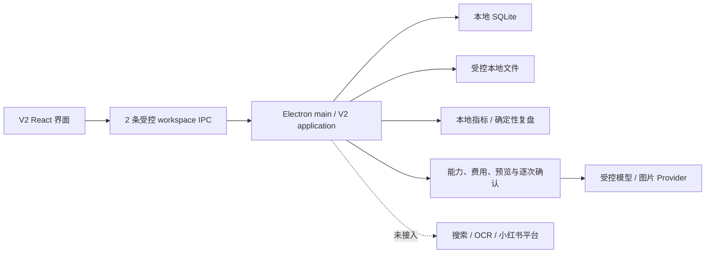

<p align="center">
  <a href="https://github.com/KAtOReNA7/Rednote-Automated-Operation-Tool/actions/workflows/ci.yml">
    
  </a>
  
  
  
  
  
</p>

# Rednote V2

面向推理小说内容运营的 Windows 本地工作台。它把账号人设、周计划、内容包和评论/私信回复整理到
一个桌面应用里，数据保存在本机，所有对外发布与发送动作仍由用户亲自在官方平台完成。

> [!IMPORTANT]
> 当前版本是**开发预览版**，不是可以直接投入日常运营的正式产品。V2-R01—R07 已获用户验收；
> V2-D-FINAL 与 R08 N1—N7 视觉已通过用户验收。R08 的 PR #17、#18 已合并到 `main`；仓库记录
> 不足以证明用户已完成合并后精确 Windows 包的人工体验。R09 正在把既有本地 Catalog 以只读方式
> 接入 V2 书库，当前等待真实 Electron 视觉验收。

## 现在能做什么

- **账号人设**：保存账号名称、定位、语气和目标读者，关闭再打开仍能恢复。
- **本周计划**：生成确定性候选，按周查看，支持单选、批量选择、跨周和任意日期时间改期。
- **内容包**：从已锁定计划生成本地内容包，编辑并保留版本，单篇或批量批准后导出。
- **互动回复**：手动粘贴评论或私信，可关联已有内容包，生成可编辑的回复建议。
- **数据复盘**：为已批准内容包手工录入 24H、72H、7D 指标，查看单篇明细、本地汇总和确定性建议。
- **只读书库**：从既有本地 Catalog 查看 Work、Expression、Edition、来源与关系，不修改目录事实。
- **受控 Provider**：配置研究、写作和图片模型槽；周计划、文案、封面和回复都先预览，再由用户逐次确认。
- **本地恢复**：计划、内容包、互动、指标和状态保存在本机 SQLite 与受控文件目录中。

内容包固定包含 6 项：封面、标题、正文、标签、建议发布时间、素材说明。**不包含置顶评论。**
受控 Provider 默认不会发起请求；费用未知时必须由用户明确确认。软件不会读取平台收件箱，也
不会替用户发送评论或私信。

## 还不能做什么

- 不能自动登录、发布、评论、私信或处理验证码与平台风控。
- 受控模型和图片 Provider 已接线，但仓库测试不证明真实供应商的质量、稳定性或费用表现。
- 搜索、页面抓取、OCR、平台指标导入和小红书业务 API 仍未接入 V2。
- 书库当前只开放既有 Catalog 的只读浏览；导入、发现、编辑、合并与拆分均未进入 R09。
- R08 已合并到 `main`，但仓库证据不代表用户已完成合并后精确 Windows 包的人工体验。
- 目前没有正式安装器、自动更新或面向生产环境的发布版本。

## 当前页面

| 页面     | 当前状态                                                               |
| -------- | ---------------------------------------------------------------------- |
| 总览     | 展示真实的本地计划、待处理内容和互动摘要，不再展示模拟表现             |
| 本周计划 | 已接通人设、批量选择、确认、锁定、自由日期时间和受控研究模型候选       |
| 内容     | 已接通三包生成、编辑、版本、批准、导出，以及受控文案与封面新版本       |
| 互动     | 已接通评论/私信粘贴、内容关联、Scripted/受控建议和手动发送事实记录     |
| 书库     | 正在接通既有 Catalog 的 Work / Expression / Edition 只读浏览与来源边界 |
| 数据复盘 | 已接通手工指标录入、单篇明细、确定性汇总和策略决策                     |
| 设置     | 已接通 workspace、人设、Provider 配置、凭据引用、能力探测和费用边界    |

## V2 开发进度

| 阶段       | 用户结果                                              | 当前结论                   |
| ---------- | ----------------------------------------------------- | -------------------------- |
| V2-R01—R07 | 产品壳、持久化、内容运营闭环、本地复盘与受控 Provider | 用户已验收                 |
| V2-D-FINAL | 在 Figma 中统一七页视觉、关键状态、响应式与交互细节   | 用户已验收                 |
| **V2-R08** | **落地 N1—N7、默认 V2 入口与显式旧版回退**            | **PR #17、#18 已合并**     |
| **V2-R09** | **迁移既有 Catalog 的只读书库核心**                   | **等待 Electron 视觉验收** |
| 发布准备   | 安装、升级、备份恢复、诊断和 Windows 端到端验收       | 范围尚未冻结               |

N1—N7 已按[最终视觉统一政策](./docs/product/v2-final-visual-convergence-policy.md)完成并获用户验收。
R08 集成提交已经进入 `main`；合并与托管验证不等同于用户对精确 Windows 包的人工体验。R09 当前
只迁移既有 Catalog 的只读浏览，视觉验收通过前不能宣称完成，更不代表产品已正式发布。

## 快速开始

### 环境

- Windows 10 或 Windows 11
- Node.js 24（最低支持 `22.16.0`）
- npm 11
- PowerShell

### 安装

```powershell
git clone https://github.com/KAtOReNA7/Rednote-Automated-Operation-Tool.git
Set-Location '.\Rednote-Automated-Operation-Tool'
npm ci
```

### 启动默认 V2

```powershell
npm run desktop:dev
```

`--v2-shell` 仍是兼容别名，但不再是进入 V2 的必要参数。只有显式执行
`npm run desktop:dev -- --legacy-shell` 才会启动保留的旧版回退界面；同时提供两个互斥参数会被拒绝。

### 本地验证

```powershell
npm run check
```

`check` 会依次运行格式、lint、类型检查、普通测试、隔离容量测试和构建。完整 Windows/Electron
发布门禁由 [GitHub Actions](https://github.com/KAtOReNA7/Rednote-Automated-Operation-Tool/actions/workflows/ci.yml)
执行。

## 数据与安全边界

- 数据默认保存在本机；云数据库、云存储和远程队列都不是运行前提。
- renderer 不能直接访问 Node、SQLite、文件系统、凭据或网络；这些能力由 Electron main 管理。
- V2 继续只使用两条受控 workspace IPC；用户正文不写进日志、错误消息或 Git。
- 真实密钥不会进入 SQLite、日志、诊断、fixture、截图或导出文件。
- 未经明确授权，应用不会探测或调用真实模型、搜索、图片或业务 API，也不会产生服务费用。
- `aiDisclosure` 默认并固定为 `false`，不参与门禁、评分、审批或排期。
- 版权风险不进入字段、门禁、评分、审批、优先级、排期或导出决策。
- 不使用开卷数据、盗版电子书或磨铁内部经营、采买和历史项目数据。

## 架构简图



主要代码位置：

- `apps/desktop`：Electron 主进程、安全边界与打包。
- `apps/web-ui`：V2 与旧版 React 界面。
- `packages/v2`：V2 workspace、周计划、内容包、互动、指标复盘和 Provider 动作合同。
- `packages/db`、`packages/storage`：SQLite 与本地文件能力。
- `docs`：产品合同、ADR、历史验收证据和任务指令。

## 旧路线说明

仓库早期已经完成 M0—M2 基础设施与研究能力；旧 M3 按 **Issue 022—028、Issue 029A 和
Minimal Issue 030** 的缩减范围收口。原 Issue 029 的 029B 保持 deferred，M4 未开始。
这些代码和文档仍作为可复用基础设施与审计记录保留，但不再作为 V2 的主用户流程。

历史 Issue 的实现细节、状态机、验收数字和合同不再逐条堆在首页，需要时请从文档中心查阅。

## 文档入口

- [文档中心](./docs/README.md)
- [产品需求](./docs/product/xiaohongshu-mystery-account-prd-v1.md)
- [开发路线图](./docs/product/xiaohongshu-development-roadmap-v1.md)
- [V2 D01 设计基线](./docs/product/v2-d01-design-baseline.md)
- [V2-R05 互动合同](./docs/product/v2-r05-interaction-contract.md)
- [V2-R06 增量指令](./docs/instructions/v2/V2-R06-local-metrics-and-deterministic-review-Codex-instruction.txt)
- [V2 最终视觉统一政策](./docs/product/v2-final-visual-convergence-policy.md)
- [历史任务指令索引](./docs/instructions/README.md)
- [贡献与代理规则](./AGENTS.md)

## 开发约定

修改前请完整阅读 [AGENTS.md](./AGENTS.md)。历史 ADR、已发布 migration 和验收证据属于审计记录，
不因 README 精简而删除或改写。新功能必须在独立分支开发，通过对应测试与 Windows CI 后再合并。

### 模型与推理强度

后续任务默认使用 `gpt-5.6-terra + medium`；是否升档只由“风险 × 不确定性”决定，不按任务规模判断。
`sol + high` 必须取得用户明确批准；完整规则与每条开发指令的固定标头见 [AGENTS.md 的模型治理章节](./AGENTS.md#13-模型与推理强度治理)。

---

<p align="center">
  <strong>开发中 · 非生产可用 · 非官方项目</strong>
  <br />
  V2-R01—R07 与 N1—N7 视觉已验收，R08 已合并，R09 只读书库待视觉验收；最终发布和互动发送始终由用户手动完成。
</p>
