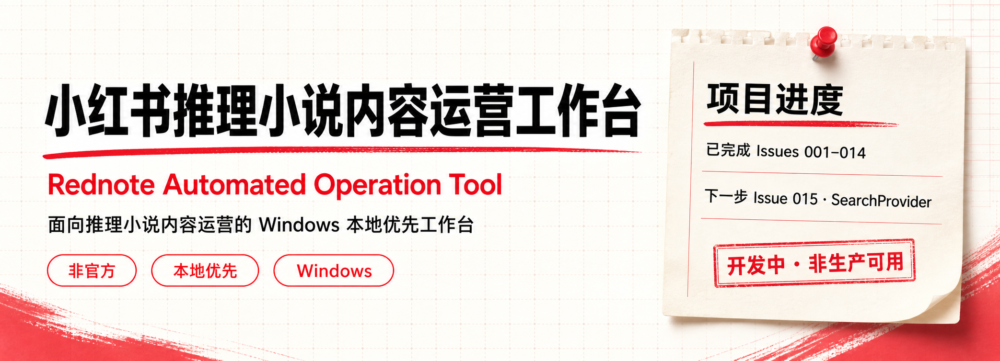
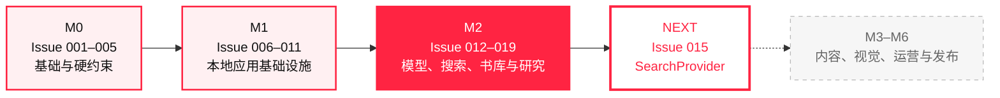
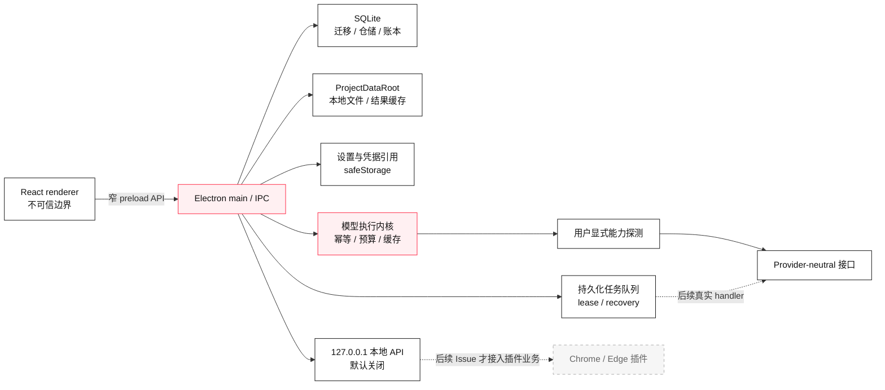

<p align="center">
  
</p>

<p align="center">
  <a href="https://github.com/KAtOReNA7/Rednote-Automated-Operation-Tool/actions/workflows/ci.yml">
    
  </a>
  
  
  
  
  
</p>

<p align="center">
  <strong>面向推理小说内容运营的 Windows 本地优先、单用户开发工作台</strong>
  <br />
  用可审计、可恢复的本地基础设施，逐步承载素材、研究、内容生产与运营流程。
</p>

<p align="center">
  <a href="#十秒了解项目">十秒了解</a> ·
  <a href="#开发进度">开发进度</a> ·
  <a href="#快速开始">快速开始</a> ·
  <a href="#架构概览">架构概览</a> ·
  <a href="#质量与安全">质量与安全</a> ·
  <a href="#文档索引">文档索引</a>
</p>

---

## 十秒了解项目

| 你想知道的                   | 当前答案                                                                        |
| ---------------------------- | ------------------------------------------------------------------------------- |
| **它是什么？**               | 面向推理小说内容运营的 Windows 本地工作台，强调隐私、可控、可恢复和人工最终确认 |
| **做到哪一步？**             | M0、M1 已完成；M2 已完成 Issue 012–014                                          |
| **下一步是什么？**           | Issue 015：通用 `SearchProvider` 接口                                           |
| **现在可以投入生产吗？**     | 不可以；当前是可靠的本地基础设施，不是内容运营成品                              |
| **会自动操作小红书吗？**     | 不会；不包含自动登录、发布、评论、私信、验证码或风控处理                        |
| **会调用真实模型并收费吗？** | 默认不会；当前开发与测试使用 Mock、合成数据和本机 loopback                      |

> [!TIP]
> 里程碑快照：M1（Issue 006—011）与 M2 Issue 012—014 均已完成验收；下一步是
> Issue 015：通用 SearchProvider。当前已具备供应商无关接口与用户显式能力探测，
> 应用不会自动访问模型服务。

> [!IMPORTANT]
> 本项目是**非官方开发项目**，不代表小红书或任何平台立场。当前版本没有接通真实内容工作流、
> 搜索、发布包或平台自动化；最终平台发布动作始终由用户手动完成。

## 开发进度



| 里程碑 | Issue 范围 | 交付主题                               | 状态             |
| ------ | ---------: | -------------------------------------- | :--------------- |
| M0     |    001–005 | 单仓库、领域规则、硬约束、Windows CI   | **已完成**       |
| M1     |    006–011 | Electron、SQLite、队列、存储、本地 API | **已完成**       |
| M2     |    012–019 | 模型接口、搜索、书库与研究             | **进行中 · 3/8** |
| M3–M6  |       后续 | 内容生产、视觉、审批、导出与发布       | **未开始**       |

### 最近完成

| Issue | 能力                                                     |    状态    |
| ----: | -------------------------------------------------------- | :--------: |
|   012 | 供应商无关的文本、结构化、视觉与图片模型接口             |   已完成   |
|   013 | 用户显式预览、预算确认、串行无重试的 Provider 能力探测   |   已完成   |
|   014 | 模型执行幂等、本地结果缓存、成本账本、预算预留与恢复语义 |   已完成   |
|   015 | 通用 `SearchProvider` 接口                               | **下一步** |

> [!NOTE]
> “下一步”只表示路线图顺序，不表示已经开始开发。仓库不会自动进入后续 Issue。

## 能力边界

| 已经具备                                                                  | 尚未接通                                                  |
| ------------------------------------------------------------------------- | --------------------------------------------------------- |
| 安全的 Electron + React 中文桌面壳                                        | 内容工作流中的真实 Provider wiring                        |
| SQLite 连续迁移、备份、回滚、外键、STRICT 表与 WAL                        | `SearchProvider`、公开页面抽取与联网研究                  |
| 支持暂停、取消、租约和重启恢复的持久化任务队列                            | Chrome / Edge 收藏插件业务                                |
| 受控 ProjectDataRoot、本地文件仓库、中文/空格/长路径                      | 选题、文案、质量编排、审批、排期、发布包与复盘            |
| 本机设置、凭据引用、脱敏诊断与默认关闭的 `127.0.0.1` 本地 API             | 面向最终用户的安装器、自动更新与正式发布版本              |
| Provider-neutral 接口、显式能力探测、统一 usage、有限重试与 Scripted Mock | 小红书自动登录、发布、评论、私信、验证码或风控处理        |
| 模型执行幂等、本地结果缓存、singleflight、成本账本与预算控制              | 任何未经用户显式授权的真实模型、搜索、图片或付费 API 调用 |

## 快速开始

### 1. 准备环境

- Windows 10 或 Windows 11
- Node.js 24（最低支持 `22.16.0`）
- npm 11
- PowerShell

### 2. 克隆并安装

```powershell
git clone https://github.com/KAtOReNA7/Rednote-Automated-Operation-Tool.git
Set-Location '.\Rednote-Automated-Operation-Tool'
npm ci
```

### 3. 验证并启动

```powershell
# 格式、lint、类型、测试与构建
npm run check

# 启动本地桌面开发版本
npm run desktop:dev
```

首次启动后可在设置页选择本地数据目录。模型配置和密钥均可留空；应用不会因为安装、启动、
迁移、保存设置、定时器或队列而自动探测或调用模型服务。

## 架构概览



关键边界：

- renderer 不直接访问 Node、SQLite、文件系统、凭据、网络或 Provider。
- preload 只公开按字段精确校验的有限 IPC 方法。
- Electron main 负责本地资源、安全策略、凭据和生命周期。
- 本地 API 默认关闭，只允许显式绑定 `127.0.0.1`，不扫描端口、不暴露到 LAN 或公网。
- Provider 探测必须由用户在设置页显式预览并确认；无自动 fallback、重试或后台触发。
- 本地缓存命中不会访问凭据、预留预算、写成本账本或发出外部请求。

## 仓库结构

| 路径                 | 职责                                                  |
| -------------------- | ----------------------------------------------------- |
| `apps/desktop`       | Electron main、preload、安全策略、运行时与 smoke      |
| `apps/web-ui`        | React 桌面界面、设置、能力探测与任务中心              |
| `apps/clipper`       | 后续浏览器插件预留边界，当前无插件业务                |
| `packages/core`      | 领域枚举、规则、状态机与不可变约束                    |
| `packages/db`        | SQLite 连接、迁移和本地仓储                           |
| `packages/workflows` | 任务队列、恢复、worker、模型执行与预算编排            |
| `packages/storage`   | ProjectDataRoot、本地文件、结果缓存和诊断存储         |
| `packages/settings`  | 非秘密设置、凭据引用与诊断合同                        |
| `packages/local-api` | loopback HTTP、配对、认证、CORS 与限流                |
| `packages/providers` | 模型接口、能力、usage、错误、transport、codec 与 Mock |
| `packages/shared`    | renderer / preload / main 共享 DTO                    |
| `docs`               | ADR、稳定合同、验收映射和安全证据                     |
| `tests`              | 领域、架构、SQLite、Electron、安全与回归测试          |

## 质量与安全

<p>
  
  
  
  
</p>

日常门禁：

```powershell
npm run format-check
npm run lint
npm run typecheck
npm run test
npm run build
```

<details>
<summary><strong>Windows / Electron 发布级门禁</strong></summary>

```powershell
npm run test:constraints
npm run test:db
npm run test:queue
npm run test:desktop
npm run test:storage
npm run test:settings
npm run test:local-api
npm run test:portability
npm run test:providers
npm run test:capabilities
npm run test:model-accounting
npm run test:electron-smoke
npm run package:desktop
npm run audit:dependencies
npm run test:packaged-smoke
```

</details>

所有测试只使用合成数据、运行时随机 token、临时 SQLite 和本机 loopback；不读取真实密钥，
不调用真实模型、搜索、图片或业务 API，也不产生真实服务费用。

## 不可变产品边界

- 最终平台发布动作始终由用户手动完成。
- 不包含小红书自动登录、发布、评论、私信、验证码或风控处理。
- 不使用小红书非公开 API，不绕过登录、验证码、付费墙或访问控制。
- 不使用开卷数据，不读取、上传、解析或索引盗版电子书。
- 不使用磨铁内部经营、采买或历史项目数据。
- 不把云数据库、云对象存储、远程队列或服务器作为必需运行依赖。
- `aiDisclosure` 固定为 `false`，且不参与任何门禁、评分、审批或排期。
- 版权风险不进入字段、门禁、评分、审批、优先级、排期或导出。
- 密钥不得进入 Git、日志、SQLite、WAL/SHM、诊断、fixture、截图或错误消息。

## 文档索引

<details open>
<summary><strong>需求与路线</strong></summary>

- [产品 PRD](./xiaohongshu-mystery-account-prd-v1.md)
- [开发路线图](./xiaohongshu-development-roadmap-v1.md)
- [Codex 总开发指令](./codex-master-development-instruction-v1.md)

</details>

<details>
<summary><strong>核心 ADR</strong></summary>

- [M0 基础架构](./docs/adr/0001-m0-foundation.md)
- [SQLite 与迁移](./docs/adr/0002-sqlite-schema-and-migrations.md)
- [持久化任务队列](./docs/adr/0003-persistent-local-job-queue.md)
- [Electron + React 桌面壳](./docs/adr/0004-electron-react-desktop-shell.md)
- [本地文件仓库](./docs/adr/0005-local-file-repository.md)
- [设置与本地凭据引用](./docs/adr/0006-settings-and-local-credential-reference.md)
- [本地 API 与插件认证](./docs/adr/0007-local-loopback-api-and-plugin-authentication.md)
- [供应商无关模型接口](./docs/adr/0008-provider-neutral-model-interfaces.md)
- [显式 Provider 能力探测](./docs/adr/0009-provider-capability-probing.md)
- [模型执行缓存与成本账本](./docs/adr/0010-model-execution-cache-and-cost-ledger.md)

</details>

<details>
<summary><strong>稳定合同与当前验收证据</strong></summary>

- [Local API v1](./docs/contracts/local-api-v1.md)
- [Provider v1](./docs/contracts/provider-v1.md)
- [Provider Capabilities v1](./docs/contracts/provider-capabilities-v1.md)
- [Model Execution v1](./docs/contracts/model-execution-v1.md)
- [Model Accounting v1](./docs/contracts/model-accounting-v1.md)
- [Issue 012 验收映射](./docs/m2-issue012-acceptance-map.md)
- [Issue 013 验收映射](./docs/m2-issue013-acceptance-map.md)
- [Issue 014 验收映射](./docs/m2-issue014-acceptance-map.md)
- [Issue 014 外发矩阵](./docs/m2-issue014-egress-matrix.md)

</details>

## 开发约定

开始修改前请先阅读 [AGENTS.md](./AGENTS.md)。新增任务必须保持硬约束、迁移规则和既有门禁，
并以真实代码、测试与命令证据更新文档；历史 ADR、验收映射与已发布 migration 不为追求整洁而改写。

---

<p align="center">
  <strong>开发中 · 非生产可用 · 非官方项目</strong>
  <br />
  下一步仅推荐 Issue 015；仓库不会自动开始后续开发。
</p>
