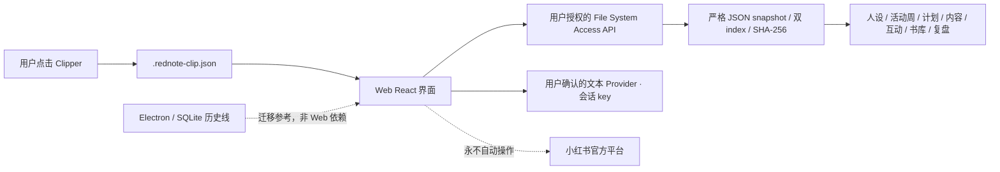

<p align="center">
  <a href="https://github.com/KAtOReNA7/Rednote-Automated-Operation-Tool/actions/workflows/ci.yml">
    
  </a>
  
  
  
  
  
  
</p>

# Rednote Studio

面向推理小说内容运营的本地优先工作台。项目正在从 Windows Electron 桌面线转向 Chrome/Edge
静态 WebUI：用户选择自己的固定本地文件夹，网页只把业务数据写入该目录。所有对外发布与发送
动作仍由用户亲自在官方平台完成。

> [!IMPORTANT]
> 当前版本是**开发预览版**，不是正式生产版本。V2-R01—R07 已获用户验收；V2-D-FINAL、R08 N1—N7
> 和 R09 均已完成用户验收并合并到 `main`。R09 已将既有本地 Catalog 以只读方式接入 V2 书库；
> R10A 与 R10B1A—R10B1C 已进入 `main`；R10D 也已进入 `main`，但旧桌面发行线现已冻结并作为迁移参考保留。R10E RC 不再合并或发布；
> WebUI W1 本地目录基础已进入 `main`；当前分支正在交付 W2 功能等价候选，接通七页、会话级
> Provider 文本动作和纯文件 Clipper 交接。W2 尚未合并，公开静态部署、旧 SQLite 迁移和桌面端
> 退休均属于尚未开始的 W3。

## WebUI 转型状态

W2 在 W1 纵切上继续使用同一个用户授权目录：总览、本周计划、内容、互动、书库、数据复盘和
设置均读取严格的 schema v2 JSON snapshot。合法 W1 schema v1 工作区会追加一份不可变 W2
snapshot 后切换双 index，原最后一份 W1 snapshot 不被改写。IndexedDB 仍只保存可丢失的目录句柄。

```powershell
npm ci
npm run build:web
npm run preview:web
```

然后用最新版 Chrome 或 Edge 打开终端显示的地址，选择一个空目录作为 `RednoteData`。Web 入口
不读取 Electron SQLite 或系统凭据，也不会自动调用模型、Search、Fetch、图片或平台 API。
可选文本 Provider 只在用户预览并确认后最多发送一次；API key 只驻留当前页面内存，刷新即清除。
文件格式与恢复合同见
[Web 本地文件基础合同](./docs/governance/web-local-folder-foundation.md)和
[W2 功能等价实施与证据](./docs/governance/web-functional-equivalence.md)。

## 现在能做什么

- **账号人设**：保存账号名称、定位、语气和目标读者，关闭再打开仍能恢复。
- **本周计划**：生成确定性候选，按周查看，支持单选、批量选择、跨周和任意日期时间改期。
- **内容包**：从已锁定计划生成本地内容包，编辑并保留版本，单篇或批量批准后导出。
- **Web 互动回复**：本地录入评论或私信、关联内容、追加回复版本并记录用户已在官方端手工发送；不会自动发送。
- **数据复盘**：为已批准内容包手工录入 24H、72H、7D 指标，查看单篇明细、本地汇总和确定性建议。
- **Web 书库**：显式预览并导入严格 Catalog JSON 或 `.rednote-clip.json`，支持本地搜索、分页、详情和来源状态。
- **Web 受控 Provider**：仅接通文案和回复文本；配置 HTTPS Base URL、模型、预算和会话 key，先预览再逐次确认。Search、Fetch 和图片关闭。
- **本地数据**：计划、内容包、互动、指标和状态保存在本机 SQLite 与受控文件目录中；R10B 已通过 PR #26 合并，提供受控备份、恢复预检、保护性切换和失败闭锁。
- **本地诊断**：在“设置 → 本地备份与恢复”先预览固定允许列表，再由用户选择目录并确认，生成只含 `manifest.json` 与 `diagnostic.json` 的本地 ZIP；不会自动上传。

内容包固定包含 6 项：封面、标题、正文、标签、建议发布时间、素材说明。**不包含置顶评论。**
受控 Provider 默认不会发起请求；费用未知时必须由用户明确确认。软件不会读取平台收件箱，也
不会替用户发送评论或私信。

## 还不能做什么

- 不能自动登录、发布、评论、私信或处理验证码与平台风控。
- 受控模型和图片 Provider 已接线，但仓库测试不证明真实供应商的质量、稳定性或费用表现。
- 搜索、页面抓取、OCR、平台指标导入和小红书业务 API 仍未接入 V2。
- 书库当前只开放既有 Catalog 的只读浏览；导入、发现、编辑、合并与拆分均未进入 R09。
- R08、R09 已获用户验收并合并到 `main`；这不等于正式生产发布。
- R10D 代码版本提供未签名、每用户的离线 NSIS 安装器；它不是自动更新、正式 GitHub Release 或公开发行级可信安装。
- Windows 10/11 的干净环境发布候选验证尚未完成。

## 当前页面

| 页面     | 当前状态                                                             |
| -------- | -------------------------------------------------------------------- |
| 总览     | 展示真实的本地计划、待处理内容和互动摘要，不再展示模拟表现           |
| 本周计划 | 已接通人设、批量选择、确认、锁定、自由日期时间和受控研究模型候选     |
| 内容     | 已接通三包生成、编辑、版本、批准、导出，以及受控文案与封面新版本     |
| 互动     | 已接通评论/私信粘贴、内容关联、Scripted/受控建议和手动发送事实记录   |
| 书库     | 已接通既有 Catalog 的 Work / Expression / Edition 只读浏览与来源边界 |
| 数据复盘 | 已接通手工指标录入、单篇明细、确定性汇总和策略决策                   |
| 设置     | 已接通 workspace、人设、Provider 配置、凭据引用、能力探测和费用边界  |

## V2 开发进度

| 阶段       | 用户结果                                              | 当前结论                                                                     |
| ---------- | ----------------------------------------------------- | ---------------------------------------------------------------------------- |
| V2-R01—R07 | 产品壳、持久化、内容运营闭环、本地复盘与受控 Provider | 用户已验收                                                                   |
| V2-D-FINAL | 在 Figma 中统一七页视觉、关键状态、响应式与交互细节   | 用户已验收                                                                   |
| **V2-R08** | **落地 N1—N7、默认 V2 入口与显式旧版回退**            | **用户验收通过，已合并**                                                     |
| **V2-R09** | **迁移既有 Catalog 的只读书库核心**                   | **用户验收通过，已合并**                                                     |
| **R10**    | **安装、升级、备份恢复、诊断和 Windows 端到端验收**   | **R10B 已合并；R10C 提供受控本地诊断；R10D 候选由 PR #29 验证，R10E 未开始** |

N1—N7 已按[最终视觉统一政策](./docs/product/v2-final-visual-convergence-policy.md)完成并获用户验收。
R08、R09 已合并；R09 的只读 Catalog 已可用。R10A 与 R10B1A—R10B1C 已合并，受控备份核心已经实现，R10B 的完整受控备份与恢复已通过 PR #26 合并；
R10C 提供受控本地脱敏诊断导出；R10D Windows 每用户离线安装、手动升级与保留数据卸载候选仍须通过 PR #29 精确 HEAD 与合并后 `main` 的 Windows CI；R10E Release Candidate 尚未开始。
R10 是发布准备而非新业务功能扩张，具体边界见
[R10 发布准备范围合同](./docs/product/v2-r10-release-readiness-scope.md)。

## 快速开始

### 环境

- Windows 10 或 Windows 11
- Node.js 24（最低支持 `22.16.0`）
- npm 11
- PowerShell

### 安装

```powershell
git clone https://github.com/KAtOReNA7/Rednote-Automated-Operation-Tool.git
Set-Location '.\Rednote-Automated-Operation-Tool'
npm ci
```

### 启动默认 V2

```powershell
npm run desktop:dev
```

`--v2-shell` 仍是兼容别名，但不再是进入 V2 的必要参数。只有显式执行
`npm run desktop:dev -- --legacy-shell` 才会启动保留的旧版回退界面；同时提供两个互斥参数会被拒绝。

### 本地验证

```powershell
npm run check
```

`check` 会依次运行格式、lint、类型检查、普通测试、隔离容量测试和构建。完整 Windows/Electron
发布门禁由 [GitHub Actions](https://github.com/KAtOReNA7/Rednote-Automated-Operation-Tool/actions/workflows/ci.yml)
执行。

## 数据与安全边界

- 数据默认保存在本机；云数据库、云存储和远程队列都不是运行前提。
- Web 入口只通过用户授权的 File System Access API 目录读写版本化 JSON；不使用 Node、Electron、
  preload、IPC、SQLite、系统凭据库或本地 HTTP 服务。
- 保留的桌面历史实现仍通过 Electron main 隔离 Node、SQLite、文件和凭据；它不是 Web 运行依赖。
- Web 会话 key 仅在用户输入与当前页面内存中存在；刷新/关闭即清除，不进入 workspace、IndexedDB、SQLite、日志、诊断、截图或导出文件。
- 未经明确授权，应用不会探测或调用真实模型、搜索、图片或业务 API，也不会产生服务费用。
- `aiDisclosure` 默认并固定为 `false`，不参与门禁、评分、审批或排期。
- 版权风险不进入字段、门禁、评分、审批、优先级、排期或导出决策。
- 不使用开卷数据、盗版电子书或磨铁内部经营、采买和历史项目数据。

## 架构简图



主要代码位置：

- `apps/desktop`：冻结保留的 Electron 主进程、安全边界与打包历史线。
- `apps/web-ui/src/v2/web`：静态 Web 入口、浏览器 runtime 与本地目录 repository。
- `apps/web-ui`：其余 V2 与旧版 React 界面，作为后续迁移参考。
- `packages/v2`：V2 workspace、周计划、内容包、互动、指标复盘和 Provider 动作合同。
- `packages/db`、`packages/storage`：SQLite 与本地文件能力。
- `docs`：产品合同、ADR、历史验收证据和任务指令。

## 旧路线说明

仓库早期已经完成 M0—M2 基础设施与研究能力；旧 M3 按 **Issue 022—028、Issue 029A 和
Minimal Issue 030** 的缩减范围收口。原 Issue 029 的 029B 保持 deferred，M4 未开始。
这些代码和文档仍作为可复用基础设施与审计记录保留，但不再作为 V2 的主用户流程。

历史 Issue 的实现细节、状态机、验收数字和合同不再逐条堆在首页，需要时请从文档中心查阅。

## 文档入口

- [文档中心](./docs/README.md)
- [产品需求](./docs/product/xiaohongshu-mystery-account-prd-v1.md)
- [开发路线图](./docs/product/xiaohongshu-development-roadmap-v1.md)
- [V2 D01 设计基线](./docs/product/v2-d01-design-baseline.md)
- [V2-R05 互动合同](./docs/product/v2-r05-interaction-contract.md)
- [V2-R06 增量指令](./docs/instructions/v2/V2-R06-local-metrics-and-deterministic-review-Codex-instruction.txt)
- [V2 最终视觉统一政策](./docs/product/v2-final-visual-convergence-policy.md)
- [R10 发布准备范围合同](./docs/product/v2-r10-release-readiness-scope.md)
- [R10D Windows 分发实施与验收](./docs/instructions/v2/R10D-windows-distribution-implementation.md)
- [历史任务指令索引](./docs/instructions/README.md)
- [贡献与代理规则](./AGENTS.md)

## 开发约定

修改前请完整阅读 [AGENTS.md](./AGENTS.md)。历史 ADR、已发布 migration 和验收证据属于审计记录，
不因 README 精简而删除或改写。新功能必须在独立分支开发，通过对应测试与 Windows CI 后再合并。

### 模型与推理强度

后续任务默认使用 `gpt-5.6-terra + medium`；是否升档只由“风险 × 不确定性”决定，不按任务规模判断。
`sol + high` 必须取得用户明确批准；完整规则与每条开发指令的固定标头见 [AGENTS.md 的模型治理章节](./AGENTS.md#13-模型与推理强度治理)。

---

<p align="center">
  <strong>开发中 · 非生产可用 · 非官方项目</strong>
  <br />
  V2-R01—R09 已验收并合并；R10B 的完整恢复已通过 PR #26 合并，R10C 提供受控本地诊断，R10D 候选正在 PR #29 验证且 R10E 尚未开始；最终发布和互动发送始终由用户手动完成。
</p>
