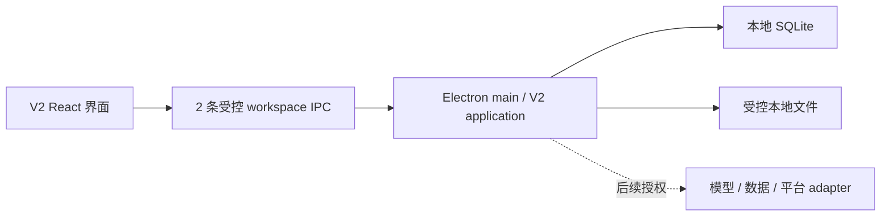

<p align="center">
  <a href="https://github.com/KAtOReNA7/Rednote-Automated-Operation-Tool/actions/workflows/ci.yml">
    
  </a>
  
  
  
  
</p>

# Rednote V2

面向推理小说内容运营的 Windows 本地工作台。它把账号人设、周计划、内容包和评论/私信回复整理到
一个桌面应用里，数据保存在本机，所有对外发布与发送动作仍由用户亲自在官方平台完成。

> [!IMPORTANT]
> 当前版本是**开发预览版**，不是可以直接投入日常运营的正式产品。V2-R01—R05 已验收；
> 下一步是 V2-R06 数据复盘。真实模型、平台连接和最终视觉统一尚未完成。

## 现在能做什么

- **账号人设**：保存账号名称、定位、语气和目标读者，关闭再打开仍能恢复。
- **本周计划**：生成确定性候选，按周查看，支持单选、批量选择、跨周和任意日期时间改期。
- **内容包**：从已锁定计划生成 3 个本地 Scripted 内容包，编辑并保留版本，单篇或批量批准后导出。
- **互动回复**：手动粘贴评论或私信，可关联已有内容包，生成可编辑的 Scripted 回复建议。
- **本地恢复**：计划、内容包、互动记录和状态保存在本机 SQLite 与受控文件目录中。

内容包固定包含 6 项：封面、标题、正文、标签、建议发布时间、素材说明。**不包含置顶评论。**
互动建议不是模型生成；软件不会读取平台收件箱，也不会替用户发送评论或私信。

## 还不能做什么

- 不能自动登录、发布、评论、私信或处理验证码与平台风控。
- V2 尚未接入真实模型、搜索、图片生成、OCR 或真实业务 API。
- 书库和数据复盘还没有完成 V2 业务迁移；V2-R06 将处理数据复盘。
- R07 真实 adapter、V2-D-FINAL 最终视觉统一和 R08 默认入口切换尚未开始。
- 目前没有正式安装器、自动更新或面向生产环境的发布版本。

## 当前页面

| 页面     | 当前状态                                                  |
| -------- | --------------------------------------------------------- |
| 总览     | 展示本地计划、待处理内容和互动摘要                        |
| 本周计划 | 已接通人设、批量选择、确认、锁定和自由日期时间            |
| 内容     | 已接通三包生成、编辑、版本、批准和本地导出                |
| 互动     | 已接通评论/私信粘贴、内容关联、建议确认和手动发送事实记录 |
| 书库     | 页面已保留，核心业务尚未迁移到 V2                         |
| 数据复盘 | 页面已保留，计划在 V2-R06 接通                            |
| 设置     | 当前承载本地 workspace 与账号人设；更多设置仍在后续阶段   |

## V2 开发进度

| 阶段       | 用户结果                                             | 状态       |
| ---------- | ---------------------------------------------------- | ---------- |
| V2-R01     | Electron 七页产品壳与固定 Mock 流程                  | 已验收     |
| V2-R02     | 本地 workspace 持久化与重启恢复                      | 已验收     |
| V2-R03     | 账号人设、周计划、批量操作与自由日期时间             | 已验收     |
| V2-R04     | 三个内容包、版本编辑、批量批准与本地导出             | 已验收     |
| V2-R05     | 评论/私信导入、内容关联与 Scripted 回复建议          | 已验收     |
| **V2-R06** | **数据导入、复盘与下一轮策略（具体范围需单独授权）** | **下一步** |
| V2-R07     | 真实 adapter                                         | 未开始     |
| V2-D-FINAL | 参考成熟商业产品，在 Figma 中统一七页视觉与交互      | 未开始     |
| V2-R08     | V2 默认入口与旧产品归档                              | 未开始     |

当前视觉可以用于功能验证，但仍有明显设计债务。根据
[最终视觉统一政策](./docs/product/v2-final-visual-convergence-policy.md)，R04—R07 优先完成本地功能闭环；
R07 完成后、R08 之前再集中进入 Figma 设计与用户验收，不在每个功能阶段反复改版。

## 快速开始

### 环境

- Windows 10 或 Windows 11
- Node.js 24（最低支持 `22.16.0`）
- npm 11
- PowerShell

### 安装

```powershell
git clone https://github.com/KAtOReNA7/Rednote-Automated-Operation-Tool.git
Set-Location '.\Rednote-Automated-Operation-Tool'
npm ci
```

### 启动 V2

```powershell
npm run desktop:dev -- --v2-shell
```

不带 `--v2-shell` 的 `npm run desktop:dev` 会启动保留的旧产品界面，仅用于兼容和回退。

### 本地验证

```powershell
npm run check
```

`check` 会依次运行格式、lint、类型检查、普通测试、隔离容量测试和构建。完整 Windows/Electron
发布门禁由 [GitHub Actions](https://github.com/KAtOReNA7/Rednote-Automated-Operation-Tool/actions/workflows/ci.yml)
执行。

## 数据与安全边界

- 数据默认保存在本机；云数据库、云存储和远程队列都不是运行前提。
- renderer 不能直接访问 Node、SQLite、文件系统、凭据或网络；这些能力由 Electron main 管理。
- V2 继续只使用两条受控 workspace IPC；用户正文不写进日志、错误消息或 Git。
- 真实密钥不会进入 SQLite、日志、诊断、fixture、截图或导出文件。
- 未经明确授权，应用不会探测或调用真实模型、搜索、图片或业务 API，也不会产生服务费用。
- `aiDisclosure` 默认并固定为 `false`，不参与门禁、评分、审批或排期。
- 版权风险不进入字段、门禁、评分、审批、优先级、排期或导出决策。
- 不使用开卷数据、盗版电子书或磨铁内部经营、采买和历史项目数据。

## 架构简图



主要代码位置：

- `apps/desktop`：Electron 主进程、安全边界与打包。
- `apps/web-ui`：V2 与旧版 React 界面。
- `packages/v2`：V2 workspace、周计划、内容包和互动流程。
- `packages/db`、`packages/storage`：SQLite 与本地文件能力。
- `docs`：产品合同、ADR、历史验收证据和任务指令。

## 旧路线说明

仓库早期已经完成 M0—M2 基础设施与研究能力；旧 M3 按 **Issue 022—028、Issue 029A 和
Minimal Issue 030** 的缩减范围收口。原 Issue 029 的 029B 保持 deferred，M4 未开始。
这些代码和文档仍作为可复用基础设施与审计记录保留，但不再作为 V2 的主用户流程。

历史 Issue 的实现细节、状态机、验收数字和合同不再逐条堆在首页，需要时请从文档中心查阅。

## 文档入口

- [文档中心](./docs/README.md)
- [产品需求](./docs/product/xiaohongshu-mystery-account-prd-v1.md)
- [开发路线图](./docs/product/xiaohongshu-development-roadmap-v1.md)
- [V2 D01 设计基线](./docs/product/v2-d01-design-baseline.md)
- [V2-R05 互动合同](./docs/product/v2-r05-interaction-contract.md)
- [历史任务指令索引](./docs/instructions/README.md)
- [贡献与代理规则](./AGENTS.md)

## 开发约定

修改前请完整阅读 [AGENTS.md](./AGENTS.md)。历史 ADR、已发布 migration 和验收证据属于审计记录，
不因 README 精简而删除或改写。新功能必须在独立分支开发，通过对应测试与 Windows CI 后再合并。

---

<p align="center">
  <strong>开发中 · 非生产可用 · 非官方项目</strong>
  <br />
  V2-R01—R05 已验收，下一步 V2-R06；最终发布和互动发送始终由用户手动完成。
</p>
