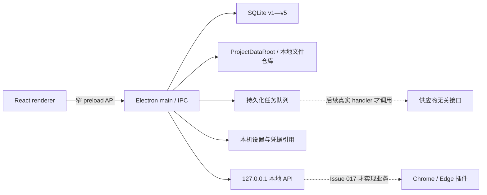

<div align="center">

# 红笺 · 推理小说内容运营工作台

**Rednote Automated Operation Tool**

面向 Windows 10/11 的本地优先、单用户推理小说内容生产与决策系统。

[](https://github.com/KAtOReNA7/Rednote-Automated-Operation-Tool/actions/workflows/ci.yml)


</div>

> [!IMPORTANT]
> 当前版本完成的是可靠、安全的本地应用基础，不是可直接投入内容生产的成品。
> Provider 合同已经建立，但真实模型、搜索、研究、图片业务、浏览器插件业务和发布包仍未
> 接通；应用不会自动调用模型或操作小红书。

## 当前开发状态

**M0（Issue 001—005）、M1（Issue 006—011）和 M2 Issue 012 均已完成验收。**

| 里程碑 | 范围                                                       |   状态    |
| ------ | ---------------------------------------------------------- | :-------: |
| M0     | TypeScript 单仓库、领域规则、硬约束、架构测试、Windows CI  |  ✅ 完成  |
| M1     | Electron、SQLite、任务队列、文件仓库、设置与凭据、本地 API |  ✅ 完成  |
| M2     | 供应商接口、能力探测、搜索、书库、研究、浏览器插件         | 🚧 进行中 |
| M3—M6  | 内容生产、视觉、审批、导出、数据闭环、Windows 发布         | ⏳ 未开始 |

截至目前已完成 Issue 001—012。下一项是 **Issue 013：能力探测**，但本轮没有探测能力、
没有把 OpenAI-compatible adapter 接入应用启动或工作流，也不会在安装、测试或启动时访问
模型服务。

### 已经具备

- 安全的 Electron 43 + React 19 中文桌面壳，启用 context isolation、sandbox 和导航限制。
- SQLite v1—v5 迁移、迁移前备份、失败回滚、STRICT 表、外键和 WAL。
- 支持暂停、取消、重试、租约和重启恢复的持久化本地任务队列。
- 支持中文、空格路径和受控目录边界的本地文件仓库。
- 本地设置向导、ProjectDataRoot、Windows 本机凭据保护和脱敏诊断。
- 默认关闭、只绑定 `127.0.0.1` 的本地 API，以及短期配对、token digest、CORS 和限流。
- 文本、结构化输出、视觉和图片生成的供应商无关接口，三态能力、统一 usage、稳定错误、
  有限安全重试、独立协议 codec、可注入 HTTP transport 和零网络 Scripted Mock。
- source 与 packaged Electron smoke、依赖审计、700+ 项自动化测试和 Windows CI。

### 尚未具备

- 真实 provider wiring、能力探测、搜索、联网研究、正式图片保存、OCR 或任何付费 API 调用。
- Chrome/Edge 收藏插件及其页面保存业务。
- 选题、文案、质量编排、审批、排期、发布包或数据复盘业务。
- 小红书登录、自动发布、评论、私信、验证码或风控处理。
- 面向最终用户的安装器、自动更新与正式发布版本。

## 快速开始

### 环境要求

- Windows 10 或 Windows 11
- Node.js 24，最低支持 `22.16.0`
- npm 11
- PowerShell

克隆并安装锁定依赖：

```powershell
git clone https://github.com/KAtOReNA7/Rednote-Automated-Operation-Tool.git
Set-Location '.\Rednote-Automated-Operation-Tool'
npm ci
```

运行核心质量门禁：

```powershell
npm run check
```

启动本地桌面开发版本：

```powershell
npm run desktop:dev
```

首次启动后可在设置页选择本地数据目录。模型配置和密钥均可留空；当前版本不会验证或调用
它们。

## 完整验证

日常检查：

```powershell
npm run format-check
npm run lint
npm run typecheck
npm run test
npm run build
```

Windows/Electron 发布级验证：

```powershell
npm run test:constraints
npm run test:db
npm run test:queue
npm run test:desktop
npm run test:storage
npm run test:settings
npm run test:local-api
npm run test:providers
npm run test:electron-smoke
npm run package:desktop
npm run audit:dependencies
npm run test:packaged-smoke
```

桌面打包优先使用经过官方校验和验证的 Electron 缓存；缓存不可用时，会复用锁定版本的
`node_modules/electron` 本地运行时生成临时打包输入，不会仅为打包再次访问外网。

所有测试只使用合成数据、运行时随机 token、临时 SQLite 和本机 loopback，不需要真实密钥，
不会调用真实 API 或产生费用。

## 架构概览



关键进程边界：

- renderer 不直接访问 Node、SQLite、文件系统、凭据或本地 HTTP。
- preload 只公开按字段校验的有限 IPC 方法。
- Electron main 负责本地资源、生命周期和安全策略。
- `packages/core`、`db`、`storage`、`workflows`、`settings`、`local-api`、`providers` 保持
  Electron 无关。
- `apps/clipper` 仍是 Issue 017 的空包；`packages/providers` 不被 renderer、preload、
  local API 或应用启动流程导入。

## 仓库结构

```text
apps/
  desktop/       Electron main、preload、安全策略、运行时与 smoke
  web-ui/        React 桌面界面、设置向导与本地 API 管理
  clipper/       Issue 017 预留包边界，尚无插件业务
packages/
  core/          领域枚举、规则、状态机与不可变约束
  db/            SQLite 连接、迁移和本地仓储
  workflows/     持久化任务队列、恢复与 worker
  storage/       ProjectDataRoot、本地文件和脱敏诊断存储
  settings/      非秘密设置、凭据引用与诊断合同
  local-api/     loopback HTTP、配对、认证、CORS 与限流
  shared/        renderer/preload/main 共享 DTO
  providers/     四类模型接口、能力、配置、usage、错误、transport、codecs 与 Mock
docs/
  adr/           架构决策记录
  contracts/     稳定协议合同
tests/           领域、架构、SQLite、Electron、安全与回归测试
```

## 不可变产品边界

- 最终发布动作始终由用户手动完成。
- 不包含小红书自动登录、发布、评论、私信、验证码或风控处理。
- 不使用开卷数据，不读取、上传、解析或索引盗版电子书。
- 不使用磨铁内部经营、采买或历史项目数据。
- 不把云数据库、云对象存储、远程任务队列或服务器作为运行依赖。
- 新发布包的 `aiDisclosure` 固定为 `false`，且不参与任何门禁。
- 版权风险完全不参与门禁、评分、审批、优先级、排期或导出。
- 密钥不得进入 Git、日志、SQLite、诊断、测试 fixture 或截图。

## 设计与验收资料

需求与路线：

- [产品 PRD](./xiaohongshu-mystery-account-prd-v1.md)
- [开发路线图](./xiaohongshu-development-roadmap-v1.md)
- [Codex 总开发指令](./codex-master-development-instruction-v1.md)

当前基础设施：

- [M0 架构决策](./docs/adr/0001-m0-foundation.md)
- [SQLite 与迁移](./docs/adr/0002-sqlite-schema-and-migrations.md)
- [持久化任务队列](./docs/adr/0003-persistent-local-job-queue.md)
- [Electron + React 桌面壳](./docs/adr/0004-electron-react-desktop-shell.md)
- [本地文件仓库](./docs/adr/0005-local-file-repository.md)
- [设置与本地凭据引用](./docs/adr/0006-settings-and-local-credential-reference.md)
- [本地 API 与插件认证](./docs/adr/0007-local-loopback-api-and-plugin-authentication.md)
- [供应商无关模型接口](./docs/adr/0008-provider-neutral-model-interfaces.md)
- [Local API v1 合同](./docs/contracts/local-api-v1.md)
- [Provider v1 合同](./docs/contracts/provider-v1.md)
- [Issue 011 验收映射](./docs/m1-issue011-acceptance-map.md)
- [Issue 012 验收映射](./docs/m2-issue012-acceptance-map.md)

## 开发约定

开始修改前请先阅读 [AGENTS.md](./AGENTS.md)，确认当前里程碑、硬约束、迁移规则和验证命令。
新增里程碑必须有独立测试和验收证据；历史 ADR、验收映射与已发布 migration 不得为追求
整洁而改写。

本项目仍处于开发阶段，暂未发布安装包，也未声明生产可用。
