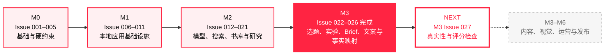
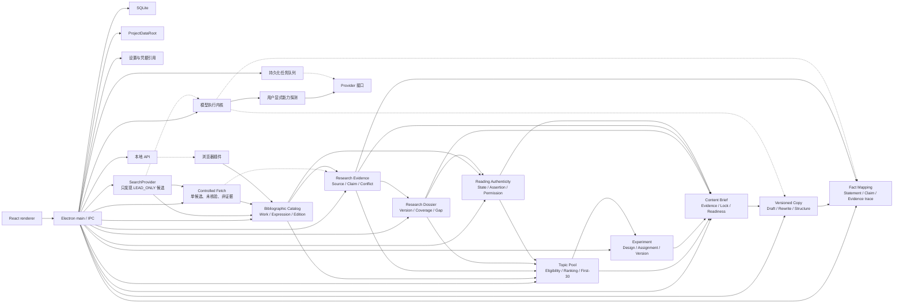

<p align="center">
  <a href="https://github.com/KAtOReNA7/Rednote-Automated-Operation-Tool/actions/workflows/ci.yml">
    
  </a>
  
  
  
  
  
</p>

<p align="center">
  <strong>面向推理小说内容运营的 Windows 本地优先、单用户开发工作台</strong>
  <br />
  用可审计、可恢复的本地基础设施，逐步承载素材、研究、内容生产与运营流程。
</p>

<p align="center">
  <a href="#十秒了解项目">十秒了解</a> ·
  <a href="#开发进度">开发进度</a> ·
  <a href="#快速开始">快速开始</a> ·
  <a href="#架构概览">架构概览</a> ·
  <a href="#质量与安全">质量与安全</a> ·
  <a href="#文档索引">文档索引</a>
</p>

---

## 十秒了解项目

| 你想知道的                   | 当前答案                                                                        |
| ---------------------------- | ------------------------------------------------------------------------------- |
| **它是什么？**               | 面向推理小说内容运营的 Windows 本地工作台，强调隐私、可控、可恢复和人工最终确认 |
| **做到哪一步？**             | M0、M1、M2 已完成；M3 已交付事实映射，并接通完全合成材料的最小本地闭环          |
| **下一步是什么？**           | M3 Issue 027（真实性与评分检查，仅规划，尚未授权或开始）                        |
| **现在可以投入生产吗？**     | 不可以；当前是可靠的本地基础设施，不是内容运营成品                              |
| **会自动操作小红书吗？**     | 不会；不包含自动登录、发布、评论、私信、验证码或风控处理                        |
| **会调用真实模型并收费吗？** | 默认不会；当前开发与测试使用 Mock、合成数据和本机 loopback                      |

> [!TIP]
> 里程碑快照：M1（Issue 006—011）与 M2（Issue 012—021）均已完成验收；M3 已完成
> Issue 026，下一步仅规划 Issue 027。浏览器插件只在用户点击后收藏当前公开页面的有限样本；候选固定为
> `LEAD_ONLY / NOT_FETCHED / UNVERIFIED / NOT_A_FACT`，且外部请求数为 0。
> Fetch 只处理研究流程明确选择的单个已持久化候选；结果仍是
> `FETCHED_NOT_EVIDENCE / UNVERIFIED / NOT_A_FACT`，不会自动入队或升级为事实。Issue 019
> 只有在用户明确接纳受控文档后，才创建版本化 Source、原子 Claim、精确 Evidence 与事实评估。
> Issue 020 再把已验证事实确定性投影为可追溯 Dossier；Issue 021 由用户显式确认六类阅读
> 状态，并把个人体验、公开资料分析、两类公开评分与内部预测严格隔离。Issue 022 再把 current
> 研究状态投影为五类结构化候选，以确定性资格、五项整数排序、semantic 去重和
> `FIRST_30_V1` 的 10/8/6/3/3 配额形成可审计计划。Issue 023 在其上建立严格单变量假设、
> control/treatment、唯一主指标、四类作品热度快照、跨至少三本 canonical Work 的结构复现、
> 确定性 assignment 和 immutable 版本历史；实验仍未执行，没有效果、显著性或 winner，
> 也没有产生真实指标。Issue 024 再把 current Topic、Dossier、Evidence、真实性权限与可选
> Experiment 约束投影为五类结构化 Content Brief，保留逐字段 provenance/lock、确定性
> readiness 和单请求受控 structured generation。Issue 025 在 current ready Brief 上建立五类
> 版本化 Draft，支持手工 scaffold、单请求完整生成、有限 scope 局部重写、字段锁、Brief lineage
> 与实际剧透警告；结构有效只表示等待质量检查。Issue 026 把 current immutable Draft 的公开文本
> 派生为 Unicode locator 与原子 Statement，以本地 allowlist 映射到 current Claim、
> FactEvaluation、Evidence 与 SourceRevision，并提供 `PASS / FACT_BLOCKED / AWAITING_REVIEW`、
> 人工复核和可选单请求 Scripted Mock 辅助。FACT_MAPPING PASS 只代表本项检查通过，仍没有
> Issue 027—030、图片、审批、导出或发布。其后的治理专项只用完全合成材料接通
> `Work → SourceRevision → Dossier → Topic → Brief → Draft → Fact Mapping` 最小本地闭环；
> 每个下游步骤仍由用户在既有工作台分别预览、确认或手工填写，不是自动内容流水线。

> [!IMPORTANT]
> 本项目是**非官方开发项目**，不代表小红书或任何平台立场。当前版本没有接通真实内容工作流、
> 真实搜索服务、发布包或平台自动化；最终平台发布动作始终由用户手动完成。

## 开发进度



| 里程碑 | Issue 范围 | 交付主题                               | 状态               |
| ------ | ---------: | -------------------------------------- | :----------------- |
| M0     |    001–005 | 单仓库、领域规则、硬约束、Windows CI   | **已完成**         |
| M1     |    006–011 | Electron、SQLite、队列、存储、本地 API | **已完成**         |
| M2     |    012–021 | 模型接口、搜索、书库与研究             | **已完成 · 10/10** |
| M3     |    022–027 | 选题、实验、文案与质量门禁             | **进行中 · 5/6**   |
| M4–M6  |       后续 | 视觉、审批、导出、运营与发布           | **未开始**         |

### 最近完成

| Issue | 能力                                                     |    状态    |
| ----: | -------------------------------------------------------- | :--------: |
|   012 | 供应商无关的文本、结构化、视觉与图片模型接口             |   已完成   |
|   013 | 用户显式预览、预算确认、串行无重试的 Provider 能力探测   |   已完成   |
|   014 | 模型执行幂等、本地结果缓存、成本账本、预算预留与恢复语义 |   已完成   |
|   015 | 统一 `SearchProvider`、候选归一化、持久限速与 SearchRun  |   已完成   |
|   016 | 候选绑定、SSRF/DNS/robots/限速、HTML 净化与离线快照      |   已完成   |
|   017 | Chrome / Edge MV3 公开页面样本收藏与本地只读查看         | **已完成** |
|   018 | 三级书目、分层发现、保守实体消歧与可逆人工决策           | **已完成** |
|   019 | 版本化来源、原子事实、精确证据、事实策略与冲突处理       | **已完成** |
|   020 | 版本化研究档案、确定性覆盖度、精确失效与显式增量重建     | **已完成** |
|   021 | 六态阅读真实性、R2 逐条确认、表达/评分权限与剧透政策     | **已完成** |
|   022 | 五类 Topic Pool、可解释排序、状态控制与 First-30 配额    | **已完成** |
|   023 | 可检验单变量实验、跨作品复现、确定性分配与版本状态       | **已完成** |
|   024 | 五类结构化 Brief、证据映射、字段锁定、就绪门与受控生成   | **已完成** |
|   025 | 五类版本化文案、实际剧透警告、局部重写、结构门与工作台   | **已完成** |
|   026 | 原子 Statement、事实映射、证据回溯、人工复核与质量汇总   | **已完成** |

> [!NOTE]
> “下一步”只表示路线图顺序，不表示已经开始开发。下一项仅规划 Issue 027，仓库不会自动进入。
> 当前额外完成的是不新增业务表、trigger、package 或质量类型的最小垂直切片验证，不计作
> Issue 027。

## 能力边界

| 已经具备                                                                    | 尚未接通                                                  |
| --------------------------------------------------------------------------- | --------------------------------------------------------- |
| 安全的 Electron + React 中文桌面壳                                          | 内容工作流中的真实 Provider wiring                        |
| SQLite 连续迁移、备份、回滚、外键、STRICT 表与 WAL                          | 视觉内容生产与正式质量工作流                              |
| 支持暂停、取消、租约和重启恢复的持久化任务队列                              | M3 的质量编排、人工审批与导出                             |
| 受控 ProjectDataRoot、本地文件仓库、中文/空格/长路径                        | 质量编排、审批、排期、发布包与复盘                        |
| 本机设置、凭据引用、脱敏诊断与默认关闭的 `127.0.0.1` 本地 API               | 面向最终用户的安装器、自动更新与正式发布版本              |
| Provider-neutral 接口、显式能力探测、统一 usage、有限重试与 Scripted Mock   | 小红书自动登录、发布、评论、私信、验证码或风控处理        |
| 模型执行幂等、本地结果缓存、singleflight、成本账本与预算控制                | 任何未经用户显式授权的真实模型、搜索、图片或付费 API 调用 |
| 五类 SearchProvider、URL/domain 归一化、SearchRun、持久限速和被动本地输入   | Search API 生产 codec、浏览器插件业务                     |
| 单候选受控 Fetch、DNS/socket 固定、robots、净化 HTML 与文本内容寻址快照     | 自动抓取、站点遍历、Source/Claim 或把抓取结果当作证据     |
| Work / Expression / Edition 三级书目、分层 Coverage 与可逆实体决策          | 质量编排、审批、排期与发布                                |
| Source revision、AtomicClaim、精确 EvidenceLocator、FactPolicy 与冲突审计   | 真实性/评分、剧透、一致性与质量编排                       |
| 版本化 Dossier、共识/争议/缺口、整数 coverage、readiness 与精确增量重建     | 封面、图片或自动质量结论                                  |
| 六态阅读真实性、R2 逐条观点、三类评分隔离、剧透策略与书库权限矩阵           | 自动发布、运营数据回收或策略复盘                          |
| 五类 Topic Pool、确定性资格/排序/去重、状态控制与 10/8/6/3/3 配额计划       | 图片或质量流程                                            |
| 单变量 Experiment、跨三本 Work 复现、热度分层、确定性 assignment 与版本历史 | 真实指标回收、效果/显著性/winner 与实验执行               |
| 五类 Content Brief、Evidence 映射、真实性/评分/剧透约束、字段锁与就绪门     | 图片、事实检查、审批或发布                                |
| 五类版本化 Copy、标题/正文/标签/评论、实际警告、lineage、锁与局部重写       | Issue 027—030 的后续质量检查、图片、审批、导出与发布      |
| FACT_MAPPING Statement、类型化 Claim 映射、证据链、精确失效与人工复核       | 整体质量通过、审批、导出或发布                            |
| 完全合成、手工确认、可重开的最小本地内容闭环                                | 真实 Provider、真实素材、自动编排或真实生产可用性         |

## 快速开始

### 1. 准备环境

- Windows 10 或 Windows 11
- Node.js 24（最低支持 `22.16.0`）
- npm 11
- PowerShell

### 2. 克隆并安装

```powershell
git clone https://github.com/KAtOReNA7/Rednote-Automated-Operation-Tool.git
Set-Location '.\Rednote-Automated-Operation-Tool'
npm ci
```

### 3. 验证并启动

```powershell
# 格式、lint、类型、普通测试、隔离容量测试与构建
npm run check

# 启动本地桌面开发版本
npm run desktop:dev
```

首次启动后可在设置页选择本地数据目录。模型配置和密钥均可留空；应用不会因为安装、启动、
迁移、保存设置、定时器或队列而自动探测或调用模型服务。

## 架构概览



关键边界：

- renderer 不直接访问 Node、SQLite、文件系统、凭据、网络或 Provider。
- preload 只公开按字段精确校验的有限 IPC 方法。
- Electron main 负责本地资源、安全策略、凭据和生命周期。
- 本地 API 默认关闭，只允许显式绑定 `127.0.0.1`，不扫描端口、不暴露到 LAN 或公网。
- Provider 探测必须由用户在设置页显式预览并确认；无自动 fallback、重试或后台触发。
- 本地缓存命中不会访问凭据、预留预算、写成本账本或发出外部请求。
- 搜索结果只是不可信候选；Fetch 必须绑定一个已持久化候选并显式执行，且不会自动成为
  Source、事实或证据。Source 接纳和事实处理必须由用户显式预览、确认。
- 书目发现只消费已持久化候选 ID，外部请求恒为 0；Observation 固定为
  `UNVERIFIED / NOT_A_FACT`。同类型强标识符和兼容上下文才允许自动关联，其余进入人工复核。
- publication relationship 只是待核验业务关系，不是法律或版权结论，也不参与门禁、评分、
  审批、优先级、排期或导出。
- 一条官方一手证据或两个已确认独立的二级证据才可验证关键事实；未解决的实质冲突固定为
  `FACT_BLOCKED`。中文摘要只帮助阅读，不能替代绑定不可变 Source revision 的原文摘录。
- Dossier 只消费已验证事实并保留每个历史版本；coverage/readiness 由本地整数规则计算。
  Source、Conflict 或书目实体变化只标记相关档案，用户预览并确认后才执行本地重建。
- 阅读状态只由用户显式预览/确认；购买、持有、Clip、搜索、Dossier 或模型不能推断已读。
  R1/R2/R3/S1/S2 与研究就绪度正交，内部预测分不会进入 renderer 或公开内容 DTO。
- Topic Pool 只消费 current Catalog、Dossier、FactPolicy 与 Expression Permission；资格和五项
  排序均为版本化整数规则。First-30 不跨类补位，pool 变化只标记已确认计划 stale，不自动重排。
- Experiment 只保存严格单变量设计与确定性 assignment，不录入真实指标，也不计算效果或 winner。
- Content Brief 只保存结构、Evidence 身份、真实性/评分/剧透约束和字段 provenance/lock；
  incomplete、blocked 或 stale 不能进入 Draft 生成，structured generation 只经受控模型内核。
- Copy 只从 current ready Brief 建立版本化标题、正文 block、标签、评论与实际剧透警告；完整生成
  和局部重写都受单请求、lineage allowlist、scope preservation 与字段锁约束。结构有效只进入
  `READY_FOR_QUALITY_PIPELINE`，不等于质量、审批、导出或发布通过。

## 仓库结构

| 路径                    | 职责                                                     |
| ----------------------- | -------------------------------------------------------- |
| `apps/desktop`          | Electron main、preload、安全策略、运行时与 smoke         |
| `apps/web-ui`           | React 桌面界面、设置、能力探测与任务中心                 |
| `apps/clipper`          | Chrome / Edge MV3 插件、显式采集、配对和本地保存         |
| `packages/core`         | 领域枚举、规则、状态机与不可变约束                       |
| `packages/db`           | SQLite 连接、迁移和本地仓储                              |
| `packages/workflows`    | 任务队列、恢复、worker、模型执行与预算编排               |
| `packages/storage`      | ProjectDataRoot、本地文件、结果缓存和诊断存储            |
| `packages/settings`     | 非秘密设置、凭据引用与诊断合同                           |
| `packages/local-api`    | loopback HTTP、配对、认证、CORS 与限流                   |
| `packages/providers`    | 模型接口、能力、usage、错误、transport、codec 与 Mock    |
| `packages/search`       | SearchProvider 合同、五类适配器、URL/域名、计划与执行    |
| `packages/fetch`        | 单候选抓取合同、SSRF/DNS、robots、传输、净化与抽取       |
| `packages/catalog`      | 书目 Observation、三级实体、规范化、消歧与发现计划       |
| `packages/evidence`     | Source/Claim/Evidence 合同、FactPolicy、冲突与确认令牌   |
| `packages/dossier`      | 版本化 Dossier、CoveragePolicy、Gap、依赖与构建合同      |
| `packages/authenticity` | 阅读状态、记忆可信度、表达/评分权限与剧透政策            |
| `packages/topics`       | 五类候选、资格、整数排序、语义去重、状态与配额求解       |
| `packages/experiments`  | 单变量合同、结构复现、热度分层、确定性 assignment 与状态 |
| `packages/briefs`       | 五类 Brief、证据映射、真实性约束、字段锁、readiness      |
| `packages/copy`         | 五类版本化文案、lineage、结构验证、字段锁与局部重写      |
| `packages/shared`       | renderer / preload / main 共享 DTO                       |
| `docs`                  | ADR、稳定合同、验收映射和安全证据                        |
| `tests`                 | 领域、架构、SQLite、Electron、安全与回归测试             |

## 质量与安全

<p>
  
  
  
  
</p>

日常门禁：

```powershell
npm run format-check
npm run lint
npm run typecheck
npm run test
npm run test:capacity
npm run build
```

<details>
<summary><strong>Windows / Electron 发布级门禁</strong></summary>

```powershell
npm run test
npm run test:capacity
npm run test:clipper-real
npm run test:electron-smoke
npm run package:clipper
npm run package:desktop
npm run audit:dependencies
npm run test:packaged-smoke
```

</details>

领域 `test:*` 脚本只用于精确定位，不进入普通/容量固定链。所有测试只使用合成数据、运行时随机
token、临时 SQLite 和本机 loopback；不读取真实密钥，
不调用真实模型、搜索、图片或业务 API，也不产生真实服务费用。

## 不可变产品边界

- 最终平台发布动作始终由用户手动完成。
- 不包含小红书自动登录、发布、评论、私信、验证码或风控处理。
- 不使用小红书非公开 API，不绕过登录、验证码、付费墙或访问控制。
- 不使用开卷数据，不读取、上传、解析或索引盗版电子书。
- 不使用磨铁内部经营、采买或历史项目数据。
- 不把云数据库、云对象存储、远程队列或服务器作为必需运行依赖。
- `aiDisclosure` 固定为 `false`，且不参与任何门禁、评分、审批或排期。
- 版权风险不进入字段、门禁、评分、审批、优先级、排期或导出。
- 密钥不得进入 Git、日志、SQLite、WAL/SHM、诊断、fixture、截图或错误消息。

## 文档索引

<details open>
<summary><strong>需求与路线</strong></summary>

- [文档中心](./docs/README.md)
- [产品 PRD](./docs/product/xiaohongshu-mystery-account-prd-v1.md)
- [开发路线图](./docs/product/xiaohongshu-development-roadmap-v1.md)
- [Codex 总开发指令](./docs/governance/codex-master-development-instruction-v1.md)
- [历史 Issue 执行指令](./docs/instructions/README.md)

</details>

<details>
<summary><strong>核心 ADR</strong></summary>

- [M0 基础架构](./docs/adr/0001-m0-foundation.md)
- [SQLite 与迁移](./docs/adr/0002-sqlite-schema-and-migrations.md)
- [持久化任务队列](./docs/adr/0003-persistent-local-job-queue.md)
- [Electron + React 桌面壳](./docs/adr/0004-electron-react-desktop-shell.md)
- [本地文件仓库](./docs/adr/0005-local-file-repository.md)
- [设置与本地凭据引用](./docs/adr/0006-settings-and-local-credential-reference.md)
- [本地 API 与插件认证](./docs/adr/0007-local-loopback-api-and-plugin-authentication.md)
- [供应商无关模型接口](./docs/adr/0008-provider-neutral-model-interfaces.md)
- [显式 Provider 能力探测](./docs/adr/0009-provider-capability-probing.md)
- [模型执行缓存与成本账本](./docs/adr/0010-model-execution-cache-and-cost-ledger.md)
- [书目三级模型与可逆实体解析](./docs/adr/0014-bibliographic-model-and-entity-resolution.md)
- [来源版本、原子事实与冲突守卫](./docs/adr/0015-source-revisions-atomic-facts-and-conflict-guard.md)
- [版本化研究档案与确定性就绪门](./docs/adr/0016-versioned-research-dossiers.md)
- [阅读真实性与表达权限分离](./docs/adr/0017-reading-authenticity-and-expression-permissions.md)
- [Topic Pool 与 First-30 配额](./docs/adr/0018-topic-pool-first-30-quota.md)

</details>

<details>
<summary><strong>稳定合同与当前验收证据</strong></summary>

- [Local API v1](./docs/contracts/local-api-v1.md)
- [Provider v1](./docs/contracts/provider-v1.md)
- [Provider Capabilities v1](./docs/contracts/provider-capabilities-v1.md)
- [Model Execution v1](./docs/contracts/model-execution-v1.md)
- [Model Accounting v1](./docs/contracts/model-accounting-v1.md)
- [Issue 012 验收映射](./docs/m2-issue012-acceptance-map.md)
- [Issue 013 验收映射](./docs/m2-issue013-acceptance-map.md)
- [Issue 014 验收映射](./docs/m2-issue014-acceptance-map.md)
- [Issue 014 外发矩阵](./docs/m2-issue014-egress-matrix.md)
- [SearchProvider V1 合同](./docs/contracts/search-provider-v1.md)
- [Search Fixture V1 合同](./docs/contracts/search-fixture-v1.md)
- [ADR 0011：SearchProvider 与发现边界](./docs/adr/0011-search-provider-and-discovery-boundary.md)
- [Issue 015 实施计划](./docs/m2-issue015-implementation-plan.md)
- [Issue 015 验收映射](./docs/m2-issue015-acceptance-map.md)
- [Issue 015 外发矩阵](./docs/m2-issue015-egress-matrix.md)
- [ADR 0012：受控公开页面抓取](./docs/adr/0012-controlled-public-page-fetch.md)
- [Controlled Fetch V1 合同](./docs/contracts/controlled-fetch-v1.md)
- [HTML Sanitization V1 合同](./docs/contracts/html-sanitization-v1.md)
- [Issue 016 实施计划](./docs/m2-issue016-implementation-plan.md)
- [Issue 016 验收映射](./docs/m2-issue016-acceptance-map.md)
- [Issue 016 外发矩阵](./docs/m2-issue016-egress-matrix.md)
- [ADR 0013：浏览器收藏与本地导入](./docs/adr/0013-browser-clipper-and-local-ingest.md)
- [Browser Clip V1 合同](./docs/contracts/browser-clip-v1.md)
- [Browser Clip Local API V1 合同](./docs/contracts/browser-clip-local-api-v1.md)
- [Issue 017 实施计划](./docs/m2-issue017-implementation-plan.md)
- [Issue 017 验收映射](./docs/m2-issue017-acceptance-map.md)
- [Issue 017 CDP 真实浏览器恢复验收](./docs/m2-issue017-recovery-acceptance.md)
- [Chrome / Edge 脱敏真实 smoke 证据](./docs/evidence/m2-issue017-real-browser-smoke.json)
- [Issue 017 外发矩阵](./docs/m2-issue017-egress-matrix.md)
- [Chrome / Edge 侧载与配对](./docs/m2-issue017-clipper-installation.md)
- [Bibliography Discovery V1 合同](./docs/contracts/bibliography-discovery-v1.md)
- [Entity Resolution V1 合同](./docs/contracts/entity-resolution-v1.md)
- [Issue 018 实施计划](./docs/m2-issue018-implementation-plan.md)
- [Issue 018 验收映射](./docs/m2-issue018-acceptance-map.md)
- [Source Evidence V1 合同](./docs/contracts/source-evidence-v1.md)
- [Atomic Claim V1 合同](./docs/contracts/atomic-claim-v1.md)
- [Fact Policy V1 合同](./docs/contracts/fact-policy-v1.md)
- [ADR 0015：来源版本、原子事实与冲突守卫](./docs/adr/0015-source-revisions-atomic-facts-and-conflict-guard.md)
- [Issue 019 实施计划](./docs/m2-issue019-implementation-plan.md)
- [Issue 019 验收映射](./docs/m2-issue019-acceptance-map.md)
- [Research Dossier V1 合同](./docs/contracts/research-dossier-v1.md)
- [Dossier Coverage 与 Readiness V1 合同](./docs/contracts/dossier-coverage-readiness-v1.md)
- [ADR 0016：版本化研究档案与确定性就绪门](./docs/adr/0016-versioned-research-dossiers.md)
- [Issue 020 实施计划](./docs/m2-issue020-implementation-plan.md)
- [Issue 020 验收映射](./docs/m2-issue020-acceptance-map.md)
- [Reading Authenticity Policy V1](./docs/contracts/reading-authenticity-policy-v1.md)
- [Expression Permission V1](./docs/contracts/expression-permission-v1.md)
- [Spoiler Policy V1](./docs/contracts/spoiler-policy-v1.md)
- [Issue 021 实施计划](./docs/m2-issue021-implementation-plan.md)
- [Issue 021 验收映射](./docs/m2-issue021-acceptance-map.md)
- [M2 收口说明](./docs/m2-closeout.md)
- [Topic Pool V1 合同](./docs/contracts/topic-pool-v1.md)
- [Topic Ranking 与 First-30 Quota V1 合同](./docs/contracts/topic-ranking-quota-v1.md)
- [Issue 022 实施计划](./docs/m3-issue022-implementation-plan.md)
- [Issue 022 验收映射](./docs/m3-issue022-acceptance-map.md)
- [Issue 022 本地验收证据](./docs/evidence/m3-issue022-local-evidence.md)
- [Experiment Design V1 合同](./docs/contracts/experiment-design-v1.md)
- [Experiment Assignment V1 合同](./docs/contracts/experiment-assignment-v1.md)
- [Experiment Metrics V1 合同](./docs/contracts/experiment-metrics-v1.md)
- [ADR 0019：版本化单变量实验与确定性分配](./docs/adr/0019-versioned-single-variable-experiments.md)
- [Issue 023 实施计划](./docs/m3-issue023-implementation-plan.md)
- [Issue 023 验收映射](./docs/m3-issue023-acceptance-map.md)
- [Issue 023 本地验收证据](./docs/evidence/m3-issue023-local-evidence.md)
- [Content Brief V1 合同](./docs/contracts/content-brief-v1.md)
- [Content Brief Readiness V1 合同](./docs/contracts/content-brief-readiness-v1.md)
- [Content Brief Generation V1 合同](./docs/contracts/content-brief-generation-v1.md)
- [ADR 0020：结构化 Content Brief、字段锁定与受控生成](./docs/adr/0020-structured-content-brief-generator.md)
- [Issue 024 实施计划](./docs/m3-issue024-implementation-plan.md)
- [Issue 024 验收映射](./docs/m3-issue024-acceptance-map.md)
- [Issue 024 本地验收证据](./docs/evidence/m3-issue024-local-evidence.md)
- [Draft Structure V1 合同](./docs/contracts/draft-structure-v1.md)
- [Copy Generation V1 合同](./docs/contracts/copy-generation-v1.md)
- [Copy Rewrite V1 合同](./docs/contracts/copy-rewrite-v1.md)
- [ADR 0021：版本化文案、结构门与受控局部重写](./docs/adr/0021-versioned-copy-generation.md)
- [Issue 025 实施计划](./docs/m3-issue025-implementation-plan.md)
- [Issue 025 验收映射](./docs/m3-issue025-acceptance-map.md)
- [Issue 025 本地验收证据](./docs/evidence/m3-issue025-local-evidence.md)
- [Draft Statement V1 合同](./docs/contracts/draft-statement-v1.md)
- [Fact Mapping V1 合同](./docs/contracts/fact-mapping-v1.md)
- [FACT_MAPPING Quality Check V1 合同](./docs/contracts/fact-mapping-quality-check-v1.md)
- [ADR 0022：事实声明映射、证据回溯与精确失效](./docs/adr/0022-factual-claim-mapping.md)
- [Issue 026 实施计划](./docs/m3-issue026-implementation-plan.md)
- [Issue 026 验收映射](./docs/m3-issue026-acceptance-map.md)
- [Issue 026 本地验收证据](./docs/evidence/m3-issue026-local-evidence.md)
- [Issue 026 外发矩阵](./docs/security/m3-issue026-egress-matrix.md)

</details>

## 开发约定

开始修改前请先阅读 [AGENTS.md](./AGENTS.md)。新增任务必须保持硬约束、迁移规则和既有门禁，
并以真实代码、测试与命令证据更新文档；历史 ADR、验收映射与已发布 migration 不为追求整洁而改写。

仓库根目录只保留贡献入口和构建工具要求的配置。产品基线、治理合同与历史 Issue 指令已经分别
归入 `docs/product/`、`docs/governance/` 和 `docs/instructions/`，避免 GitHub 首页文件列表被
历史执行材料淹没。

---

<p align="center">
  <strong>开发中 · 非生产可用 · 非官方项目</strong>
  <br />
  M3 正在进行；Issue 022–026 已完成，下一步仅规划 Issue 027，仓库不会自动开始后续开发。
</p>
