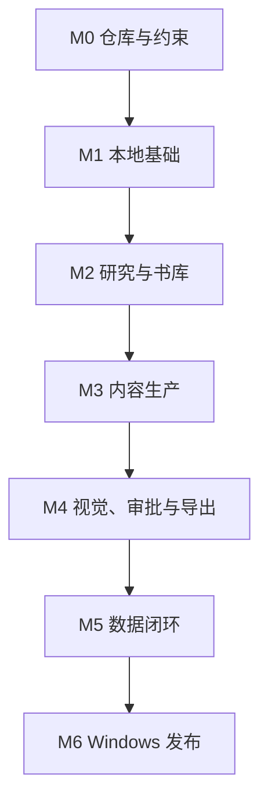

# 小红书推理小说内容运营系统：GitHub Issue 路线图

版本：V1.0  
日期：2026-07-27  
依据：`xiaohongshu-mystery-account-prd-v1.md`

> **2026-07-29 Issue 018 修订**
>
> 固定 50 本不再是 Issue 018、M2 或端到端完成门槛。完成改由版本化 DiscoveryPlan、
> 必要分层覆盖或可解释缺口、Work/Expression/Edition 关系、Observation provenance、
> 保守去重和可逆人工决策共同证明。10,000 Work 仅为合成容量测试规模。

---

## 1. 执行原则

- 每个 Issue 必须有明确输入、输出、测试和完成定义。
- 不允许用一个超大 PR 实现整个系统。
- 每个里程碑完成后先做独立验收，再进入下一阶段。
- 所有涉及真实模型调用的功能必须先有 mock/fixture 测试。
- Windows 10/11 是目标环境；不能只在 Linux 上验证。
- 密钥不得进入 Git、日志、SQLite、截图或测试 fixture。
- AI 标识和版权两项硬约束必须有持续回归测试。
- 不开发任何小红书自动登录、发布、评论、私信或风控处理功能。

---

## 2. 推荐里程碑与依赖

---

## 3. Issue 清单

## M0：仓库、架构与不可变约束

### Issue 001：初始化 TypeScript 单仓库

标签：`epic:m0`、`type:foundation`、`priority:p0`

目标：

- 建立 desktop、web-ui、clipper、core、db、providers、workflows、shared 的单仓库结构。
- 配置格式化、静态检查、单元测试、构建和提交检查。

验收：

- 一条命令可安装依赖、检查、测试和构建；
- 路径包含中文或空格时测试仍可运行；
- README 给出 Windows PowerShell 启动方式；
- 不创建云端依赖。

依赖：无。

### Issue 002：建立领域规则与状态机

标签：`epic:m0`、`type:domain`、`priority:p0`

目标：

- 实现内容状态机、阅读状态、剧透等级、审批等级和异常状态。
- 将领域规则与 UI、数据库和模型供应商解耦。

验收：

- 非法状态转换被拒绝；
- AI 标识和版权不会产生异常状态；
- 状态转换有单元测试。

依赖：001。

### Issue 003：建立两项硬约束回归测试

标签：`epic:m0`、`type:test`、`priority:p0`、`constraint`

目标：

- 将 AI 标识默认关闭和版权完全不参与门禁固化为测试。

验收：

- 新建发布包 `aiDisclosure === false`；
- 任何检查结果都不能自动将其设为 `true`；
- AI 参与度不改变分数、审批等级、排期和导出；
- 系统不存在版权风险检查类型；
- 素材来源变化不因版权原因改变状态；
- CI 中该测试不可跳过。

依赖：002。

### Issue 004：建立禁止范围架构测试

标签：`epic:m0`、`type:test`、`priority:p0`、`constraint`

目标：

- 防止后续误加平台托管功能和禁用数据源。

验收：

- 仓库没有小红书登录、发布、评论、私信、验证码或风控接口；
- 没有开卷导入器；
- 没有盗版电子书上传或解析入口；
- 没有云数据库、对象存储和远程任务队列依赖。

依赖：001。

### Issue 005：建立持续集成

标签：`epic:m0`、`type:devops`、`priority:p0`

目标：

- 配置静态检查、单元测试、集成测试、构建和依赖审计。

验收：

- Windows runner 为必过检查；
- 其他系统 runner 可用于快速反馈，但不能替代 Windows；
- 失败日志不泄露环境变量；
- 003、004 属于必过套件。

依赖：001、003、004。

---

## M1：Windows 本地应用基础

### Issue 006：实现 Electron 桌面壳和 React UI

标签：`epic:m1`、`type:frontend`、`priority:p0`

目标：

- 创建桌面窗口、导航、错误边界和基础页面。

验收：

- Windows 10/11 可启动；
- UI 不依赖公网域名；
- 关闭和重新打开应用不丢失设置；
- 支持中文界面。

依赖：001。

### Issue 007：实现 SQLite Schema 与迁移

标签：`epic:m1`、`type:data`、`priority:p0`

目标：

- 实现 PRD 中核心实体、外键、索引、事务和迁移。

验收：

- 空数据库可自动初始化；
- 迁移前自动生成本地备份；
- 迁移失败不会损坏原数据库；
- 不存在版权风险字段和检查类型。

依赖：001、002。

### Issue 008：实现本地文件仓库

标签：`epic:m1`、`type:storage`、`priority:p0`

目标：

- 管理来源快照、照片、生成图、导入、导出、日志和备份。

验收：

- 根目录可配置；
- 支持中文、空格和长路径的合理处理；
- 文件名净化；
- 不调用云存储；
- 数据库只保存相对路径或受控绝对路径。

依赖：006、007。

### Issue 009：实现持久化本地任务队列

标签：`epic:m1`、`type:backend`、`priority:p0`

目标：

- 使用 SQLite 任务表实现暂停、取消、重试和重启恢复。

验收：

- 应用异常退出后未完成任务可恢复；
- 任务具有幂等键；
- 相同任务不会重复扣费；
- 不依赖 Redis 或云端队列。

依赖：007。

### Issue 010：实现设置向导与本地密钥引用

标签：`epic:m1`、`type:settings`、`priority:p0`、`security`

目标：

- 配置数据目录、中转站、模型、预算和账号策略。

验收：

- 明文密钥不进入数据库、日志、导出和备份；
- 支持从操作系统凭据库或本地忽略文件读取；
- UI 只显示密钥已配置状态；
- 生成脱敏诊断报告。

依赖：006、007、008。

### Issue 011：实现本地 API 与插件认证

标签：`epic:m1`、`type:backend`、`priority:p0`、`security`

目标：

- 为 UI 和浏览器插件提供只绑定本机的 API。

验收：

- 只监听 `127.0.0.1`；
- 插件使用安装时生成的本地令牌；
- CORS 和请求体大小受限；
- 未认证请求被拒绝；
- 无公网监听。

依赖：006、010。

---

## M2：模型、搜索、书库和研究

### Issue 012：实现供应商无关的模型接口

标签：`epic:m2`、`type:provider`、`priority:p0`

目标：

- 实现文本、结构化输出、视觉、图片和 usage 的接口。

验收：

- 具体 Base URL 和模型 ID 来自配置；
- 不硬编码某个模型；
- 有 mock provider；
- 网络错误、限流、超时和无效 JSON 可恢复；
- 不依赖 Batch API。

依赖：009、010。

### Issue 013：实现能力探测

标签：`epic:m2`、`type:provider`、`priority:p0`

目标：

- 探测中转站支持的文本、JSON、工具、搜索、图片、视觉、usage 和 Batch 能力。

验收：

- 探测失败不会泄露密钥；
- 结果保存为能力矩阵；
- 不支持的能力不会被调用；
- Batch 不支持时后台队列仍正常工作。

依赖：012。

### Issue 014：实现模型运行记录、缓存与成本账本

标签：`epic:m2`、`type:backend`、`priority:p0`

目标：

- 保存输入哈希、提示词版本、模型、usage、缓存命中和费用。

验收：

- 相同输入可命中缓存；
- 来源或提示词变化会失效；
- 80 美元预警；
- 100 美元停止新的非必要调用；
- 无价格时不伪造费用。

依赖：007、009、012。

### Issue 015：定义 SearchProvider 接口

标签：`epic:m2`、`type:provider`、`priority:p0`

目标：

- 支持模型联网、独立搜索 API、定向来源、浏览器收藏和手工链接。

验收：

- 每种来源返回统一结构；
- 请求有限速、超时和页面大小限制；
- 不绕过登录、付费墙、验证码或访问控制；
- 有 fixture 测试。

依赖：009、011、013。

### Issue 016：实现定向公开页面抓取与文本抽取

标签：`epic:m2`、`type:research`、`priority:p0`

目标：

- 抓取明确研究任务指定的公开页面并保存必要快照。

验收：

- HTML 净化；
- URL、重定向、MIME 和文件大小校验；
- 内容哈希去重；
- 不全站遍历；
- 不采集无关个人信息。

依赖：008、015。

### Issue 017：实现 Chrome/Edge 收藏插件

标签：`epic:m2`、`type:extension`、`priority:p0`

目标：

- 用户点击后保存当前页、选中文本、备注、截图和可见指标。

验收：

- Chrome、Edge 均可运行；
- 不后台自动翻页或批量采集；
- 未启动本地应用时给出清晰提示；
- 保存结果可在桌面应用查看；
- 本地令牌不暴露在页面脚本。

依赖：011。

### Issue 018：实现书目发现与去重

标签：`epic:m2`、`type:research`、`priority:p0`

目标：

- 在空书库中按版本化 DiscoveryPlan 发现作品，建立 Work、Expression、Edition 三级关系，
  并保守处理原名、译名、ISBN、版本和多方出版关系。

验收：

- 每个必要分层均有已处理结果或明确、可解释的缺口；
- 支持日本、欧美、中文出版、中文网络悬疑及原创/翻译、纸书/电子/网络载体分层；
- 每个 Work、Expression 和 Edition 均可回溯到 `UNVERIFIED / NOT_A_FACT` Observation；
- 同类型强标识符与兼容上下文才自动关联，gold fixture 自动误合并为 0；
- 人工可预览、合并、拆分、撤销并审计并发冲突；
- 10,000 Work 合成容量测试使用索引和分页，不能冒充真实业务发现成果；
- 不使用开卷。

依赖：015、016。

### Issue 019：实现来源、原子事实与冲突处理

标签：`epic:m2`、`type:research`、`priority:p0`

目标：

- 将事实声明与证据逐条关联。

验收：

- 关键事实有正式来源或两个独立来源；
- 支持日文、英文来源并输出中文摘要；
- 冲突事实可见；
- 未解决冲突可触发 `FACT_BLOCKED`；
- 模型记忆不被记录为最终来源。

依赖：012、016、018。

### Issue 020：实现研究档案

标签：`epic:m2`、`type:research`、`priority:p0`

目标：

- 为每本书生成可版本化的研究档案。

验收：

- 包含共识、争议、资料缺口和覆盖度；
- 研究档案能追溯到事实声明；
- 来源更新后可增量重建；
- 低覆盖度不能进入内容生成。

依赖：019。

### Issue 021：实现阅读状态和真实性规则

标签：`epic:m2`、`type:domain`、`priority:p0`

目标：

- 实现 UNKNOWN、READ_CLEAR、READ_FUZZY、READ_UNVERIFIED、NOT_READ。

验收：

- 默认 UNKNOWN；
- 只有用户操作可设 READ_CLEAR；
- 非 READ_CLEAR 不能生成具体第一人称体验；
- 资料分析评分与个人评分严格区分。

依赖：007、018。

---

## M3：选题、文案和质量门禁

### Issue 022：实现选题池与首批 30 篇配额

标签：`epic:m3`、`type:strategy`、`priority:p0`

目标：

- 自动生成并排序选题，满足五类内容配额。

验收：

- 首批配额为 10/8/6/3/3；
- 显示证据充分度、内容适配、差异性、成本和审批工作量；
- 用户可锁定、搁置和归档；
- 不因 AI 标识或版权改变排序。

依赖：020、021。

### Issue 023：实现实验管理

标签：`epic:m3`、`type:analytics`、`priority:p1`

目标：

- 保存假设、变量、版本、主指标、护栏和样本。

验收：

- 一次实验明确一个主要变量；
- 作品热度可作为分层字段；
- 同一结构可跨三本书复现；
- 实验配置可版本化。

依赖：022。

### Issue 024：实现内容简报生成器

标签：`epic:m3`、`type:content`、`priority:p0`

目标：

- 在写作前生成结构化简报。

验收：

- 包含目标读者、核心判断、反方、证据、剧透、评分类型和禁用表达；
- JSON Schema 校验；
- 未满足事实覆盖度时拒绝创建可生成简报；
- 用户可编辑和锁定字段。

依赖：019、022、023。

### Issue 025：实现文案生成器

标签：`epic:m3`、`type:content`、`priority:p0`

目标：

- 生成标题、正文、标签和置顶评论。

验收：

- 支持不剧透、完整拆解、横向比较、网络/出版比较和文化分析；
- 风格为观点鲜明、短句、少量冷幽默；
- 不讨论 AI 实验；
- 支持局部重写；
- 保存提示词和模型版本。

依赖：012、014、024。

### Issue 026：实现事实映射检查

标签：`epic:m3`、`type:quality`、`priority:p0`

目标：

- 将正文中的关键事实映射到 claims。

验收：

- 无来源关键事实触发 `FACT_BLOCKED`；
- 可查看声明—证据—正文映射；
- 观点与事实正确区分；
- 引用数字和奖项信息有来源。

依赖：019、025。

### Issue 027：实现真实性与评分检查

标签：`epic:m3`、`type:quality`、`priority:p0`

目标：

- 阻止虚构第一人称和错误评分类型。

验收：

- UNKNOWN、READ_FUZZY、READ_UNVERIFIED、NOT_READ 均不能输出具体亲历表达；
- PERSONAL 分数需要 READ_CLEAR 和用户确认；
- RESEARCH_ANALYSIS 明确标注；
- INTERNAL_PREDICTION 不进入发布包。

依赖：021、025。

### Issue 028：实现剧透检查

标签：`epic:m3`、`type:quality`、`priority:p0`

目标：

- 检测泄露和警告完整性。

验收：

- FULL 缺封面、标题或开头警告时不能导出；
- 警告补齐后可通过；
- 完整剧透本身不被阻止；
- NONE 内容的标题、摘要和评论不泄露答案。

依赖：025。

### Issue 029：实现一致性、重复度和标题检查

标签：`epic:m3`、`type:quality`、`priority:p0`

目标：

- 检测内部矛盾、同质化、标题正文不一致和模板损坏。

验收：

- 与历史草稿和已发布内容比较；
- 相似度结果可解释；
- 不以单一阈值自动删除内容；
- 失败返回明确修改建议。

依赖：025。

### Issue 030：实现质量编排器

标签：`epic:m3`、`type:workflow`、`priority:p0`

目标：

- 统一运行事实、真实性、剧透、重复、一致性和结构检查。

验收：

- 失败项对应明确状态；
- 检查可重试和版本化；
- 不包含 AI 标识或版权风险检查；
- 通过后进入审批队列。

依赖：026、027、028、029、003。

---

## M4：图片、审批和发布包

### Issue 031：实现图像供应商接口

标签：`epic:m4`、`type:provider`、`priority:p0`

目标：

- 支持图像生成、编辑和结果下载，且与文本供应商解耦。

验收：

- 模型和端点可配置；
- 有 mock provider；
- 失败、超时和不兼容有明确提示；
- 生成记录可追溯；
- 不将密钥写入图片元数据。

依赖：012、013、014。

### Issue 032：实现实拍图导入与处理

标签：`epic:m4`、`type:media`、`priority:p0`

目标：

- 导入原图、裁切、背景处理、排版和缩略图。

验收：

- 原图和处理图分开保存；
- 支持批量导入；
- EXIF 按配置保留或移除；
- 图片操作不覆盖原文件。

依赖：008。

### Issue 033：实现封面和多页信息卡渲染

标签：`epic:m4`、`type:media`、`priority:p0`

目标：

- 结合生成图、实拍图和程序化排版。

验收：

- 竖版封面和多页卡片；
- 文字溢出、截断、缺字和对比度检查；
- 同一栏目视觉模板稳定；
- 实验变量可配置；
- 空白或损坏图片不能进入发布包。

依赖：031、032。

### Issue 034：实现快速/重点审批队列

标签：`epic:m4`、`type:frontend`、`priority:p0`

目标：

- 按内容风险和工作量分层，不使用 AI 或版权因素。

验收：

- 快速和重点队列规则符合 PRD；
- 40 篇候选可批量操作；
- 用户可改层级；
- 显示预计审批时间。

依赖：030、033。

### Issue 035：实现同屏审批界面

标签：`epic:m4`、`type:frontend`、`priority:p0`

目标：

- 同屏显示标题、正文、图片、来源、检查结果和修改差异。

验收：

- 支持快捷键；
- 通过、退回、编辑、搁置和批量排期；
- 修改自动保存；
- 快速切换无明显卡顿；
- 不显示 AI 标识或版权提醒。

依赖：034。

### Issue 036：实现本地发布包导出

标签：`epic:m4`、`type:export`、`priority:p0`

目标：

- 按篇和整周导出可手工发布的文件。

验收：

- 目录、manifest、文案、来源和图片齐全；
- 图片按顺序编号；
- `aiDisclosure` 固定为 `false`；
- 不含版权风险字段；
- 支持整周 ZIP；
- 无任何平台发布调用。

依赖：003、004、035。

### Issue 037：实现周计划与审批时间预算

标签：`epic:m4`、`type:planning`、`priority:p1`

目标：

- 规划每周 28—40 篇，并控制在 240 分钟审批预算内。

验收：

- 显示快速/重点数量和预计用时；
- 数量不足时说明原因；
- 不为凑数绕过事实门禁；
- 支持拖放排期。

依赖：034、035。

---

## M5：发布数据与策略闭环

### Issue 038：实现手动发布登记

标签：`epic:m5`、`type:data-entry`、`priority:p0`

目标：

- 用户手动填写平台 URL、发布时间和备注。

验收：

- 不要求系统登录平台；
- 可关联发布包；
- 可修正误填；
- 支持未提供 URL 的发布记录。

依赖：036。

### Issue 039：实现手动指标表单

标签：`epic:m5`、`type:data-entry`、`priority:p0`

目标：

- 录入 24 小时、72 小时和 7 日指标。

验收：

- 缺失值与 0 区分；
- 字段按实际可用性配置；
- 派生指标仅在合法分母下计算；
- 修改有审计记录。

依赖：038。

### Issue 040：实现创作者中心文件导入

标签：`epic:m5`、`type:import`、`priority:p1`

目标：

- 支持 CSV/Excel 字段映射、预览和导入。

验收：

- 原始文件保存在本地；
- 导入前预览；
- 重复导入幂等；
- 字段异常不破坏已有数据；
- 有 fixture。

依赖：039。

### Issue 041：实现截图 OCR 导入

标签：`epic:m5`、`type:ocr`、`priority:p1`

目标：

- 从数据页截图识别可见指标。

验收：

- 识别结果先预览；
- 低置信字段要求人工确认；
- 保存原图和 OCR 置信度；
- 不把无法识别字段填成 0。

依赖：031、039。

### Issue 042：实现实验分析

标签：`epic:m5`、`type:analytics`、`priority:p0`

目标：

- 分析栏目、书籍热度、国家、剧透、标题和视觉变量。

验收：

- 热门/冷门分层；
- 至少三本书才声明结构复现；
- 小样本标注不确定性；
- 单篇爆款不自动扩展为全局结论；
- 缺失数据不参与错误计算。

依赖：023、039。

### Issue 043：实现每周复盘和策略建议

标签：`epic:m5`、`type:strategy`、`priority:p0`

目标：

- 生成保留、扩大、缩减和挑战建议。

验收：

- 显示证据、混杂和置信程度；
- 推荐下周数量、结构、成本和审批时间；
- 未经用户确认不改变计划；
- 建议可追溯到分析结果。

依赖：037、042。

---

## M6：备份、Windows 发布与最终验收

### Issue 044：实现本地备份与恢复

标签：`epic:m6`、`type:reliability`、`priority:p0`

目标：

- 备份 SQLite、配置、来源、图片、导入和发布包。

验收：

- 不包含明文密钥；
- 可选择本地磁盘目录；
- 恢复前检查版本；
- 恢复失败不覆盖当前数据；
- 无云上传。

依赖：008、007。

### Issue 045：实现脱敏诊断包

标签：`epic:m6`、`type:support`、`priority:p1`

目标：

- 导出版本、能力矩阵、任务错误和环境摘要。

验收：

- 不含密钥、完整请求头和用户未选择的正文数据；
- 用户可预览内容；
- 可用于离线排障。

依赖：010、014。

### Issue 046：Windows 10/11 安装与升级

标签：`epic:m6`、`type:release`、`priority:p0`

目标：

- 生成可安装版本并支持安全升级。

验收：

- Win10、Win11 均安装、启动、卸载；
- 升级保留数据；
- 不要求 WSL；
- 中文路径和空格路径通过；
- 安装包不内置任何密钥。

依赖：006、044。

### Issue 047：端到端验收测试

标签：`epic:m6`、`type:test`、`priority:p0`

目标：

- 验证从空书库到数据复盘的完整闭环。

验收场景：

1. 配置 mock 或测试供应商；
2. 按 DiscoveryPlan 完成必要分层处理，显示覆盖、可解释缺口、三级关系和 provenance；
3. 建立事实和研究档案；
4. 生成首批 30 篇；
5. 形成 40 篇周候选；
6. 完成质量检查；
7. 批量审批；
8. 导出发布包；
9. 手动登记发布；
10. 通过表单、文件和截图导入数据；
11. 生成下周策略；
12. 应用重启后数据和任务恢复；
13. 两项硬约束和禁止范围全部通过。

依赖：036、040、041、043、044、046。

### Issue 048：V1 文档与交接

标签：`epic:m6`、`type:docs`、`priority:p0`

目标：

- 完成用户指南、运维指南、数据备份、模型配置和故障处理。

验收：

- 非技术用户可按文档启动和备份；
- 明确说明系统不自动发布；
- 文档不要求开卷、云服务、域名或手机；
- 不在文档中粘贴真实密钥示例。

依赖：047。

---

## 4. 第一阶段实际开发顺序

严格按以下顺序执行：

1. Issue 001：仓库；
2. Issue 002：领域规则；
3. Issue 003：两项硬约束测试；
4. Issue 004：禁止范围测试；
5. Issue 005：Windows CI；
6. Issue 007：SQLite；
7. Issue 009：任务队列；
8. Issue 006：桌面 UI；
9. Issue 008：本地文件；
10. Issue 010：设置；
11. Issue 011：本地 API。

原因：

- 先把不可变约束写成测试，避免后续架构漂移；
- 先完成持久化和任务恢复，再接入会产生费用的模型；
- Windows CI 在最早阶段建立，避免最后才发现平台问题。

---

## 5. 明确禁止事项

开发期间不得：

- 擅自加入 AI 标识提醒、评分、审批或门禁；
- 擅自加入版权风险分类、提醒、评分、审批或门禁；
- 将素材来源字段转化为版权判定；
- 开发或预留小红书自动发布、自动登录、自动评论或私信；
- 使用小红书非公开 API；
- 绕过验证码、风控、登录、付费墙或访问控制；
- 使用开卷数据；
- 读取、上传、解析或索引盗版电子书；
- 使用磨铁内部经营、采买或历史项目数据；
- 加入云数据库、云对象存储、云任务队列或远程服务器作为必需组件；
- 假设中转站必然支持 Web Search、Batch、图片或视觉；
- 硬编码模型名称、Base URL、价格或速率；
- 在仓库、日志、数据库、fixture 或截图中保存真实密钥；
- 用单篇爆款结果自动改写全局策略；
- 为达到 40 篇而绕过事实门禁；
- 在没有用户确认的情况下生成具体第一人称阅读体验；
- 合并尚未完成验收的里程碑。

---

## 6. 发布门槛

只有同时满足以下条件，V1 才能标记为完成：

- Issue 001—048 中所有 `priority:p0` 关闭；
- 所有约束测试通过；
- Windows 10 和 Windows 11 端到端测试通过；
- 至少一个主动搜索适配器可用；
- Chrome 和 Edge 收藏插件可用；
- 真实或测试环境完成首批 30 篇生成；
- 40 篇周候选可审批和导出；
- 三类数据回收方式可用；
- 100 美元预算门禁可验证；
- 没有云依赖；
- 没有小红书平台操作代码；
- 用户指南和本地备份恢复完成。
