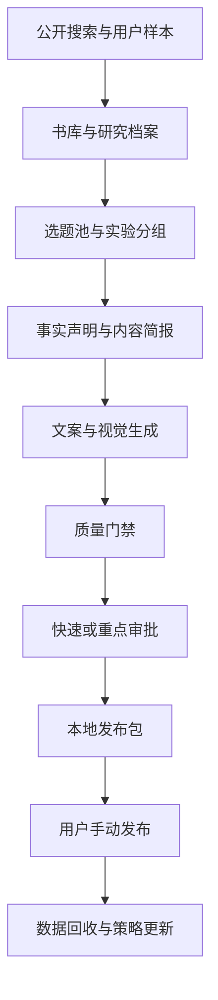
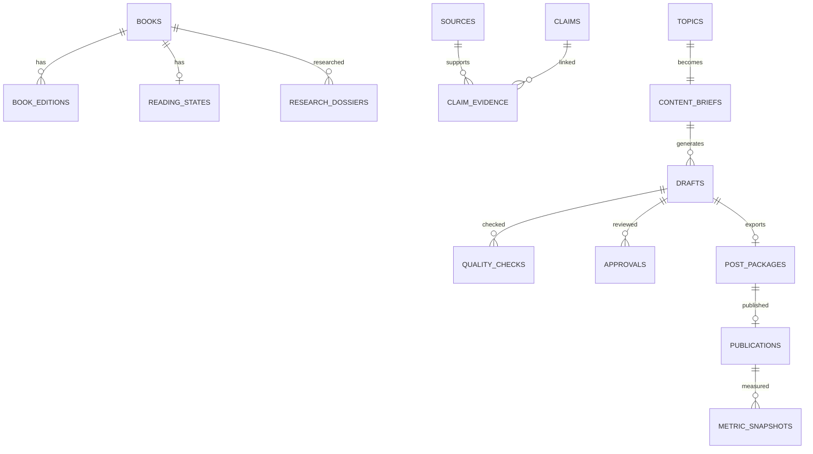

# 小红书推理小说内容运营系统 PRD

版本：V1.0  
日期：2026-07-27  
状态：需求冻结，可进入开发  
项目性质：个人、非商业化运营实验  

> **2026-07-29 书目规模口径修订（Issue 018）**
>
> “首轮至少 50 本”不再作为生产发现、M2 完成或端到端验收门槛。书目发现改以版本化
> DiscoveryPlan 的必要分层覆盖、可解释缺口、Work/Expression/Edition 关系、Observation
> provenance 和保守去重结果验收；10,000 Work 只用于合成工程容量测试。首批 30 篇内容实验
> 与每周 28—40 篇运营目标不受本修订影响。

---

## 0. 文档结论

本项目建设一个运行在 Windows 10/11 本地电脑上的“推理小说内容运营生产与决策系统”。

系统负责：

- 自动发现和整理图书；
- 收集公开资料与用户主动保存的小红书样本；
- 形成选题、研究档案和事实依据；
- 生成标题、正文、标签、置顶评论、封面及配图；
- 执行事实、逻辑、真实性、重复度、剧透提示和渲染检查；
- 每周形成 28—40 篇候选内容和完整发布包；
- 支持批量审批、手动发布后的数据回收、实验分析与策略迭代。

系统不负责：

- 登录或操作小红书；
- 自动发布、评论、私信、养号；
- 调用小红书非公开接口；
- 处理验证码、风控或模拟真人行为；
- 使用开卷数据；
- 使用磨铁内部经营、采买或未获准进入项目的业务数据；
- 运营偶像、音乐或泛娱乐内容；
- 云端部署、云存储、域名或手机审批。

最终产品形态是本地桌面应用，数据、图片、发布包和备份均存放在用户指定的本地目录。

---

## 1. 已冻结的产品约束

以下约束属于不可被实现方案、模型建议、检查器或后续策略自动修改的产品规则。

### 1.1 AI 标识

```yaml
ai_disclosure:
  default: false
  auto_enable: false
  publishing_gate: false
  affect_score: false
  delay_content: false
  require_confirmation: false
```

产品行为：

- 所有新内容包的 `aiDisclosure` 默认值固定为 `false`。
- 任何模型、检查器和工作流均不得自动改为 `true`。
- AI 参与程度不影响生成、质量评分、审批层级、排期或导出。
- 系统不提醒用户必须开启标识。
- 系统不操作小红书发布端的相关选项。
- 不开发平台检测规避、对抗检测或伪装人工原创的功能。

### 1.2 版权风险

```yaml
copyright:
  publishing_gate: false
  block_content: false
  delay_content: false
  require_approval: false
  affect_score: false
  affect_priority: false
```

产品行为：

- 版权风险不属于内容门禁。
- 不建立版权风险评分器。
- 不因封面、书影、作者照片、宣传物料、引用或图片来源改变内容状态。
- 不因版权原因增加审批步骤、降低优先级、推迟或阻止导出。
- 系统可保存素材来源，目的仅为内容管理和事实回溯，不构成版权审查。

### 1.3 平台动作边界

```yaml
platform_boundary:
  automatic_login: false
  automatic_publish: false
  automatic_scheduling_on_platform: false
  automatic_commenting: false
  automatic_direct_messages: false
  captcha_handling: false
  risk_control_bypass: false
  final_platform_action: manual
```

### 1.4 数据与部署边界

```yaml
deployment:
  operating_systems:
    - Windows 11
    - Windows 10
  local_only: true
  cloud_server: false
  cloud_database: false
  cloud_object_storage: false
  public_domain: false
  mobile_approval: false
```

### 1.5 数据来源排除项

- 不使用开卷数据。
- 不读取或保存盗版电子书文件及其正文。
- 不使用磨铁内部业务数据、采买数据或历史项目数据。
- 不以模型记忆作为最终事实来源。
- 不进行小红书批量爬取。

---

## 2. 用户、账号与业务背景

### 2.1 使用者

- 单用户。
- 用户是磨铁图书运营人员。
- 账号属于用户个人实验，不属于公司项目。
- 账号前期不公开职业背景，后期根据运营结果单独决定。
- V1 不建设多用户、权限组织或团队协作功能。

### 2.2 可用素材

用户确认可以：

- 拍摄公司实体书并用于个人账号；
- 使用官方封面图；
- 使用宣传海报；
- 使用作者照片；
- 提及尚未公开的新书；
- 获得明确的内部授权说明。

上述信息只影响素材来源和可用范围，不进入版权门禁。

### 2.3 初始书库

用户不提供预置书单。系统必须按照版本化 DiscoveryPlan 自行完成书目发现、基础资料整理和
保守去重，并对必要分层逐项给出已处理结果或明确、可解释的缺口。

系统不能据此假设用户读过任何一本书。所有作品默认是“公开资料研究对象”，只有用户明确确认后，才可进入个人阅读状态。

---

## 3. 产品目标与非目标

### 3.1 核心目标

在前 90 天完成以下验证：

1. AI 深度辅助能否稳定生产达到人工可发布标准的推理小说内容；
2. “明确判断、短句表达、允许批评”的账号风格能否建立稳定识别度；
3. 不剧透选书、完整诡计拆解、横向比较三类内容中，哪类能稳定带来收藏、评论和关注；
4. 内容结构的成功是否能跨作品复现，而非只依赖热门书名；
5. 每周 240 分钟审批能否支撑 28—40 篇发布；
6. 在每月 100 美元模型预算内，研究、生成、图像和复盘是否可持续。

### 3.2 90 天目标值

这些是产品运营目标，不是上线硬门槛：

| 指标 | 目标 |
|---|---:|
| 每周候选内容 | 35—40 篇 |
| 每周最终发布 | 28—40 篇 |
| 每周人工审批总时长 | 不超过 240 分钟 |
| 发布包事实硬错误率 | 低于 1% |
| 发布包结构损坏率 | 0% |
| 内容重复拦截准确率 | 可解释且人工抽检通过 |
| 有完整事实来源链的资料型内容 | 100% |
| 月度模型实际费用 | 不超过 100 美元 |
| 可复现内容结构 | 至少 2 种 |

### 3.3 非目标

V1 不追求：

- 商业转化、带货或广告；
- 多账号矩阵；
- 无人值守运营；
- 实时热点秒级响应；
- 小红书全站数据采集；
- 精确估算平台自然流量分发机制；
- 替代用户做最终观点判断；
- 将用户没有读过的作品伪装成亲身阅读体验。

---

## 4. 账号定位与内容策略

### 4.1 工作定位

主定位：

> 推理小说判卷室：用明确标准判断一本推理小说哪里成立、哪里不成立，以及是否值得读。

核心深度栏目：

> 诡计拆解实验室：完整拆解诡计、伏线、公平性、误导和逻辑漏洞。

扩展方向：

> 悬疑小说样本库：比较日本、欧美、中文出版与网络悬疑作品。

“推理小说判卷室”是工作名称，不强制作为最终账号昵称。V1 应支持随时修改账号名称、简介和视觉主题，而不改变内容数据。

### 4.2 价值主张

> 不依赖“神作”“封神”“后劲太大”等空泛形容词，用明确标准告诉读者一本推理小说为什么值得读，或者为什么不成立。

### 4.3 表达风格

- 观点鲜明；
- 短句、直接；
- 少量冷幽默；
- 可以批评作品；
- 不攻击作者、读者或群体；
- 不为了互动刻意制造对立；
- 不在账号中讨论这是 AI 运营实验。

### 4.4 内容范围

V1 包含：

- 日本推理；
- 欧美推理与悬疑；
- 中文出版推理；
- 网络悬疑；
- 不剧透选书与排雷；
- 核心诡计与逻辑结构分析；
- 横向比较与评分；
- 推理小说相关文化热点和社会现象。

V1 排除：

- 偶像；
- 音乐；
- 演唱会；
- 泛娱乐热点；
- 粉圈争议。

### 4.5 首批内容结构

首批 30 篇作为校准样本：

| 内容组 | 数量 | 验证目标 |
|---|---:|---|
| 不剧透单书判卷 | 10 | 收藏和选书价值 |
| 完整诡计与逻辑拆解 | 8 | 评论、关注和深度认可 |
| 两部或多部作品横向比较 | 6 | 鲜明观点和互动 |
| 网络悬疑与出版推理比较 | 3 | 受众扩展能力 |
| 推理小说与文化现象 | 3 | 泛文化触达 |

首批 30 篇不要求用户预先提供书名，由系统从公开来源发现候选书目后生成。

### 4.6 发布节奏

用户选择每周 240 分钟审批、28—40 篇发布。

推荐启动节奏：

| 周期 | 候选 | 计划发布 | 目的 |
|---|---:|---:|---|
| 第 1 周 | 35 | 28 | 校准事实、口吻和审批用时 |
| 第 2 周 | 38 | 28—35 | 复现优胜结构 |
| 第 3—4 周 | 40 | 35—40 | 验证稳定产能 |
| 第 5 周起 | 最多 40 | 28—40 | 按数据动态分配 |

系统不得为了达到数量目标自动降低事实门禁。

---

## 5. 内容真实性与评分规则

### 5.1 阅读状态

| 状态 | 定义 | 允许表达 |
|---|---|---|
| `UNKNOWN` | 未确认是否读过，默认状态 | 仅公开资料型表达 |
| `READ_CLEAR` | 用户读过且记忆明确 | 可使用经用户认可的第一人称体验 |
| `READ_FUZZY` | 用户读过但记忆模糊 | 只使用用户重新确认的观点 |
| `READ_UNVERIFIED` | 用户记得读过但不能确认细节 | 不生成具体第一人称体验 |
| `NOT_READ` | 用户确认没读 | 仅公开资料型表达 |

系统不得通过“用户从事图书行业”“用户看过很多书”或模型推断自动设置 `READ_CLEAR`。

### 5.2 评分类型

- `PERSONAL`：只允许用于 `READ_CLEAR`，且最终分数由用户确认。
- `RESEARCH_ANALYSIS`：根据公开资料和结构化标准产生，公开时注明为资料分析评分。
- `INTERNAL_PREDICTION`：只用于选题排序，不进入发布包。

### 5.3 评分维度

默认维度可按作品类型调整：

- 核心诡计；
- 逻辑严密度；
- 伏线公平性；
- 误导设计；
- 人物；
- 节奏；
- 氛围；
- 主题表达；
- 结局完成度；
- 类型创新；
- 阅读门槛；
- 推荐匹配度。

每个公开分数必须同时保存：

- 分数；
- 评分类型；
- 简短理由；
- 支撑来源或用户确认记录；
- 适用读者；
- 不适用读者。

---

## 6. 剧透规则

用户选择允许完整拆解核心诡计。

### 6.1 内容分级

| 级别 | 含义 | 展示要求 |
|---|---|---|
| `NONE` | 不剧透 | 无警告 |
| `LIGHT` | 轻度涉及设定或前段情节 | 标题或开头标明“轻微剧透” |
| `FULL` | 完整诡计、凶手、结局或关键逻辑 | 封面、标题和正文开头均有明确剧透警告 |

### 6.2 门禁

- `FULL` 内容缺少剧透警告时，不得进入“可导出”状态。
- 剧透门禁只检查提示是否完整，不阻止完整剧透内容本身。
- 不剧透内容不得在封面、标题、摘要、标签或置顶评论中泄露核心答案。

---

## 7. 数据来源与研究系统

### 7.1 来源通道

用户选择以下三类结合：

1. 系统通过公开网页和搜索服务主动研究；
2. 用户粘贴小红书账号、笔记或其他页面链接；
3. 浏览器收藏插件保存用户主动选择的公开样本。

### 7.2 来源优先级

事实研究优先顺序：

1. 出版社、作者、奖项、书目数据库等正式来源；
2. 正式采访、媒体报道和可核验行业资料；
3. 多个独立书评或读者讨论；
4. 小红书、豆瓣、论坛和社交媒体，只作为用户问题、争议和表达样本；
5. 模型自身知识只用于生成检索词，不作为最终证据。

### 7.3 自动书库发现

系统必须在没有用户书单的情况下完成：

1. 根据国家、类型、奖项、作者、出版动态和内容实验需求生成检索计划；
2. 搜索候选作品；
3. 建立书名、原名、译名、作者、ISBN、出版社、出版时间等基础记录；
4. 合并同一作品的不同版本、译名和再版；
5. 保存事实来源；
6. 为候选书生成研究充分度和内容潜力评分；
7. 形成带分层覆盖、缺口、provenance 和去重前后基数的报告，不以全局固定书数判定完成。

### 7.4 搜索能力要求

中转站是否支持联网搜索尚未确认，因此搜索层必须使用可替换适配器：

- `ModelWebSearchAdapter`：中转站支持模型联网工具时使用；
- `SearchApiAdapter`：配置独立公共搜索服务时使用；
- `CuratedSourceAdapter`：从出版社、奖项、书目站点、RSS 或站内搜索入口发现；
- `BrowserClipAdapter`：接收用户主动收藏页面；
- `ManualUrlAdapter`：接收用户粘贴的链接。

V1 不依赖 Batch API。后台任务通过本地持久化队列运行。

上线前必须至少有一个主动搜索适配器和 `BrowserClipAdapter` 可用，否则“系统自行建立书库”验收不通过。

### 7.5 页面采集边界

- 只抓取研究任务明确指定的公开页面；
- 设置请求频率、超时、重试和页面大小上限；
- 遵守站点访问限制；
- 不绕过登录、付费墙、验证码或访问控制；
- 不进行全站遍历；
- 不保存与研究无关的个人信息；
- 页面正文只保存研究所需快照、摘要和事实声明。

### 7.6 事实声明模型

研究资料不直接进入文案。系统先形成原子事实声明：

```text
声明：某书获得某奖项
对象：作品
来源：奖项官方网站 URL
证据摘录：支持该声明的短文本
抓取时间：时间戳
置信度：高
冲突状态：无
```

每条可公开的关键事实至少满足其一：

- 一个一级正式来源；
- 两个互相独立、内容一致的二级来源。

存在冲突且无法解决时，相关内容进入“事实待处理”，不得导出。

---

## 8. 市场样本与浏览器收藏插件

### 8.1 插件支持范围

- Chrome；
- Microsoft Edge；
- Manifest V3；
- 只在用户点击“保存样本”时采集当前页面。

### 8.2 收藏字段

- 页面 URL；
- 页面标题；
- 账号名称；
- 发布时间；
- 用户选中的文本；
- 用户备注；
- 用户手动填写的可见互动数据；
- 页面截图，可选；
- 内容类型标签；
- 收藏时间。

插件不自动翻页、不批量访问账号主页、不后台持续采集。

### 8.3 样本用途

- 分析标题结构；
- 分析封面信息量；
- 分析内容结构；
- 记录用户问题和争议；
- 识别同质化表达；
- 形成实验假设。

样本文案不得被大段复用。系统应生成结构特征，而不是复制文本。

---

## 9. AI 与模型层

### 9.1 接入条件

- 用户已有 OpenAI 兼容中转站；
- 月度预算 100 美元；
- 允许缓存结果；
- Batch API 是否支持未知，因此不作为 V1 依赖；
- 不在 PRD、日志、数据库或导出包中保存明文密钥。

### 9.2 供应商无关接口

模型配置不得硬编码具体模型名称：

```yaml
provider:
  base_url: user_configured
  api_key_env: CONTENT_AI_API_KEY
  protocol: openai_compatible

models:
  research: user_configured
  writing: user_configured
  review: user_configured
  embedding: optional
  image: user_configured
```

模型能力在设置向导中探测：

- 文本生成；
- 结构化 JSON；
- 工具调用；
- 联网搜索；
- 图片生成；
- 图片理解；
- 最大上下文；
- 速率限制；
- 返回 usage；
- 是否支持 Batch。

不支持的能力通过其他适配器补齐，不能假设“OpenAI 兼容”代表全部端点兼容。

### 9.3 模型角色

| 角色 | 任务 |
|---|---|
| Research Planner | 拆解研究问题、生成检索计划 |
| Evidence Extractor | 从页面提取原子事实和证据 |
| Topic Strategist | 生成并排序选题 |
| Writer | 生成标题、正文、标签和评论 |
| Critic | 检查逻辑、风格、重复和真实性 |
| Fact Checker | 将文案声明映射回来源 |
| Spoiler Checker | 判断剧透等级和警告完整性 |
| Visual Director | 生成图像方案与版式指令 |
| Strategy Analyst | 分析发布数据并更新实验权重 |

同一个模型可承担多个角色，但提示词、输入输出结构和调用记录必须分离。

### 9.4 缓存

缓存键至少包含：

- 任务类型；
- 规范化输入哈希；
- 模型 ID；
- 提示词版本；
- 参数版本；
- 来源内容哈希。

来源内容、提示词或模型改变时自动失效。用户可清除缓存，但清除不应删除书库、草稿或发布数据。

### 9.5 成本控制

预算控制分三层：

1. 月度硬上限：100 美元；
2. 预警线：80 美元；
3. 任务预算：每周和每类任务单独配置。

若中转站不返回费用：

- 使用用户配置的模型价格表计算；
- 价格表缺失时，以 token、图片数和调用次数进行限额；
- 不得虚构美元成本。

达到硬上限后：

- 阻止新的非必要模型调用；
- 已生成内容、审批、导出和数据录入仍可使用；
- 允许用户显式修改预算后继续。

---

## 10. 图像生产

用户选择“图像生成模型 + 实拍图”结合。

### 10.1 图像模式

| 模式 | 输入 | 输出 |
|---|---|---|
| 实拍主图 | 用户照片 | 裁切、背景处理、文字排版 |
| 生成主图 | 视觉指令 | AI 生成背景或主视觉 |
| 混合模式 | 实拍书籍 + 生成背景 | 合成封面 |
| 信息卡 | 书目信息、评分 | 程序化文字卡片 |

即使用户未选择“纯程序化模板”为主模式，系统仍可使用程序化排版保证文字清晰和批量一致性。

### 10.2 输出规格

- 默认竖版；
- 支持封面加多页图文卡；
- 保留安全边距；
- 所有文字在导出前执行溢出、截断、缺字和对比度检查；
- 图片生成失败不能以空白图进入发布包；
- 图片文件保存到本地项目目录。

### 10.3 视觉策略

- 同一栏目保持稳定的字体、网格和识别色；
- 不同实验只改变被测试的视觉变量；
- 不以复杂装饰牺牲标题可读性；
- AI 图像提示词、模型、参数和随机种子可追溯；
- 实拍原图与处理后图片分开保存。

---

## 11. 内容生产工作流



### 11.1 状态机

```text
IDEA
→ RESEARCHING
→ RESEARCH_READY
→ DRAFTING
→ REVIEW_REQUIRED
→ APPROVAL_READY
→ APPROVED
→ EXPORT_READY
→ EXPORTED
→ MANUALLY_PUBLISHED
→ MEASURED
```

异常状态：

- `FACT_BLOCKED`
- `GENERATION_FAILED`
- `VISUAL_FAILED`
- `USER_REJECTED`
- `ARCHIVED`

AI 标识和版权不产生任何异常状态。

### 11.2 内容简报

每篇内容在生成前必须有：

- 内容类型；
- 目标读者；
- 核心判断；
- 反方或限制条件；
- 是否剧透；
- 关键事实声明；
- 评分类型；
- 标题实验组；
- 视觉实验组；
- 预期用户动作；
- 禁止使用的表达。

### 11.3 发布包

每篇导出为独立目录：

```text
YYYY-MM-DD_slug/
  manifest.json
  title.txt
  body.txt
  tags.txt
  pinned-comment.txt
  sources.md
  images/
    01-cover.png
    02-card.png
    ...
```

`manifest.json` 至少包含：

- 内容 ID；
- 书籍 ID；
- 内容类型；
- 剧透等级；
- `aiDisclosure: false`；
- 计划发布时间；
- 标题版本；
- 正文版本；
- 图片列表；
- 实验 ID；
- 审批记录；
- 来源引用；
- 导出时间。

不包含版权风险字段。

---

## 12. 质量门禁与审批

### 12.1 保留的硬门禁

| 门禁 | 失败结果 |
|---|---|
| 书名、作者、版本等关键事实无法核验 | `FACT_BLOCKED` |
| 正文关键事实无法映射到来源 | `FACT_BLOCKED` |
| 文案前后矛盾 | 返回修改 |
| 未确认读过却使用具体第一人称体验 | 返回修改 |
| 不剧透内容泄露核心答案 | 返回修改 |
| 完整剧透缺少明确警告 | 返回修改 |
| 与历史内容高度重复 | 返回修改 |
| 标题与正文不一致 | 返回修改 |
| 图片缺失、损坏、文字溢出 | `VISUAL_FAILED` |
| 输出结构或 JSON 损坏 | `GENERATION_FAILED` |

### 12.2 明确不属于门禁

- AI 标识；
- AI 参与程度；
- 版权风险；
- 使用官方封面、书影、海报、作者照片或引用；
- 对作品的负面评价；
- 普通观点争议；
- 完整剧透本身。

### 12.3 审批分层

快速审批：

- 事实全部通过；
- 使用已验证模板；
- 无新增争议事实；
- 无完整诡计拆解；
- 无强烈负面行业判断；
- 图片渲染正常。

重点审批：

- 完整剧透或诡计拆解；
- 明确低分；
- 涉及作者、出版社或行业判断；
- 使用新来源类型；
- 模型置信度较低；
- 新视觉结构。

每周 240 分钟建议分配：

| 环节 | 时间 |
|---|---:|
| 快速审批 25—30 篇 | 50—75 分钟 |
| 重点审批 8—12 篇 | 80—120 分钟 |
| 周计划与数据复盘 | 30—45 分钟 |
| 机动修订 | 15—35 分钟 |

### 12.4 审批界面

必须支持：

- 键盘快捷键；
- 标题、正文、图片、来源同屏查看；
- 通过、退回、编辑、搁置；
- 快速切换候选；
- 显示本周剩余审批时间估计；
- 批量排期；
- 审批前后差异；
- 用户修改自动保存；
- 不显示 AI 标识或版权风险提醒。

---

## 13. 数据回收与实验分析

用户接受四种数据方式：

1. 手动填写；
2. 创作者中心导出文件；
3. 上传数据截图并识别；
4. 三者结合。

### 13.1 指标

按平台实际可获得字段保存：

- 曝光；
- 点击或阅读；
- 点赞；
- 收藏；
- 评论；
- 分享；
- 关注增量；
- 主页访问；
- 发布时间；
- 24 小时、72 小时、7 日快照。

系统不得将缺失字段填成 0；必须区分 `NULL` 与真实的 0。

### 13.2 派生指标

仅在分母存在且大于 0 时计算：

- 点赞率；
- 收藏率；
- 评论率；
- 分享率；
- 关注转化率；
- 每千曝光互动；
- 收藏/点赞比；
- 评论/阅读比。

### 13.3 实验原则

- 每次实验尽量只改变一个主要变量；
- 同一结构至少跨三本书复现；
- 热门书与冷门书分层分析；
- 不以单篇爆款直接改写全部策略；
- 小样本结果必须标明不确定性；
- 系统推荐不自动执行，进入下一周计划前由用户确认。

### 13.4 策略更新

系统每周生成：

- 本周表现摘要；
- 同类型内容对比；
- 标题、封面、作品热度和内容结构的分层结果；
- 可复现信号；
- 可能的混杂变量；
- 下周保留、扩大、缩减和挑战实验；
- 推荐发布数量；
- 预计模型成本与审批时间。

---

## 14. 系统架构

### 14.1 推荐实现

采用本地优先的 TypeScript 单仓库：

```text
apps/
  desktop/       Windows 桌面壳与本地服务
  web-ui/        React 审批与运营界面
  clipper/       Chrome/Edge 收藏插件
packages/
  core/          领域模型和状态机
  db/            SQLite schema、迁移和仓储
  providers/     模型、搜索、图片、OCR 适配器
  workflows/     研究、生成、检查、导出、复盘
  shared/        类型、配置、日志和测试工具
```

推荐组件：

- Electron：Windows 桌面容器；
- React + TypeScript：用户界面；
- Fastify 或 Electron 内置本地 HTTP 服务：插件与 UI 通信；
- SQLite：结构化数据；
- 本地文件目录：图片、页面快照、发布包和备份；
- SQLite 持久化任务表：后台队列，不引入 Redis；
- JSON Schema 或 Zod：模型结构化输出校验；
- Playwright：桌面 UI 和关键流程测试；
- Vitest：单元与集成测试。

允许 Codex在开工时选择同等级替代库，但不得改变：

- 本地运行；
- SQLite；
- 本地文件存储；
- 无云依赖；
- Windows 10/11；
- 浏览器收藏插件；
- 供应商适配器；
- 无自动发布。

### 14.2 本地端口与安全

- 本地服务只绑定 `127.0.0.1`；
- 端口动态分配或由用户配置；
- 收藏插件使用安装时生成的本地令牌；
- 密钥存入操作系统凭据库或本地忽略文件，不进入 SQLite 和日志；
- HTML 页面进行净化；
- 文件名、URL 和导入文件均做校验；
- 日志默认脱敏；
- 备份不包含明文密钥。

### 14.3 本地目录

```text
project-data/
  database/
  sources/
  photos/
    originals/
    processed/
  generated-images/
  exports/
  imports/
  backups/
  logs/
```

用户可在设置中更改根目录。程序不得要求 OneDrive、iCloud 或任何云盘。

### 14.4 后台任务

任务类型：

- 书目发现；
- 页面抓取；
- 事实提取；
- 研究档案生成；
- 选题评分；
- 文案生成；
- 质量检查；
- 图片生成；
- OCR；
- 数据分析；
- 发布包导出。

任务必须：

- 可暂停；
- 可取消；
- 可重试；
- 重启后恢复；
- 保存输入哈希、输出、耗时、模型和成本；
- 避免同一任务重复扣费。

---

## 15. 数据模型

### 15.1 核心实体

#### `account_profiles`

- `id`
- `working_name`
- `bio`
- `occupation_disclosure`，默认 `DEFERRED`
- `ownership`，固定 `PERSONAL`
- `tone_config_json`
- `content_scope_json`
- `created_at`
- `updated_at`

#### `books`

- `id`
- `canonical_title`
- `original_title`
- `author_id`
- `country_or_region`
- `language`
- `work_type`
- `series_name`
- `series_order`
- `synopsis`
- `discovery_status`
- `research_score`
- `topic_score`
- `created_at`
- `updated_at`

#### `book_editions`

- `id`
- `book_id`
- `isbn`
- `translated_title`
- `translator`
- `publisher`
- `publication_date`
- `edition_label`
- `cover_asset_id`
- `is_motie`
- `is_unreleased`
- `source_id`

#### `authors`

- `id`
- `canonical_name`
- `original_name`
- `country_or_region`
- `profile`
- `source_id`

#### `reading_states`

- `id`
- `book_id`
- `state`
- `memory_note`
- `user_confirmed_at`
- `personal_score`
- `score_confirmed_at`

#### `sources`

- `id`
- `url`
- `title`
- `publisher_or_site`
- `source_tier`
- `source_type`
- `retrieved_at`
- `content_hash`
- `local_snapshot_path`
- `language`
- `user_supplied`

#### `claims`

- `id`
- `subject_type`
- `subject_id`
- `predicate`
- `value_json`
- `confidence`
- `conflict_status`
- `created_at`

#### `claim_evidence`

- `claim_id`
- `source_id`
- `evidence_excerpt`
- `locator`
- `supports_or_contradicts`

#### `clips`

- `id`
- `url`
- `platform`
- `account_name`
- `page_title`
- `published_at`
- `selected_text`
- `user_note`
- `visible_metrics_json`
- `screenshot_path`
- `tags_json`
- `created_at`

#### `research_dossiers`

- `id`
- `book_id`
- `version`
- `research_questions_json`
- `summary`
- `consensus_json`
- `disputes_json`
- `source_coverage_score`
- `status`
- `created_at`

#### `topics`

- `id`
- `book_id`
- `topic_type`
- `angle`
- `core_judgment`
- `audience`
- `spoiler_level`
- `trend_score`
- `fit_score`
- `evidence_score`
- `novelty_score`
- `effort_score`
- `priority_score`
- `status`

#### `experiments`

- `id`
- `name`
- `hypothesis`
- `primary_metric`
- `guardrail_metrics_json`
- `variable_name`
- `variants_json`
- `start_at`
- `end_at`
- `status`

#### `content_briefs`

- `id`
- `topic_id`
- `experiment_id`
- `content_type`
- `target_reader`
- `core_judgment`
- `counterpoints_json`
- `spoiler_level`
- `required_claim_ids_json`
- `score_type`
- `title_variant`
- `visual_variant`
- `desired_action`
- `forbidden_phrases_json`
- `status`

#### `drafts`

- `id`
- `brief_id`
- `version`
- `title`
- `body`
- `tags_json`
- `pinned_comment`
- `generation_run_id`
- `user_edited`
- `status`
- `created_at`

#### `assets`

- `id`
- `asset_type`
- `origin`
- `source_id`
- `original_path`
- `processed_path`
- `mime_type`
- `width`
- `height`
- `content_hash`
- `generation_run_id`
- `metadata_json`

`assets` 不包含版权风险等级。

#### `quality_checks`

- `id`
- `draft_id`
- `check_type`
- `result`
- `severity`
- `details_json`
- `checker_version`
- `created_at`

`check_type` 不得包含 AI 标识检查或版权风险检查。

#### `approvals`

- `id`
- `draft_id`
- `approval_tier`
- `decision`
- `user_note`
- `time_spent_seconds`
- `decided_at`

#### `post_packages`

- `id`
- `draft_id`
- `planned_publish_at`
- `export_path`
- `manifest_json`
- `ai_disclosure`，默认且保持 `false`
- `exported_at`
- `status`

#### `publications`

- `id`
- `post_package_id`
- `platform`
- `platform_post_url`
- `manually_published_at`
- `user_note`

#### `metric_snapshots`

- `id`
- `publication_id`
- `snapshot_window`
- `captured_at`
- `source_method`
- `metrics_json`
- `import_file_path`
- `ocr_confidence`

#### `model_runs`

- `id`
- `role`
- `provider`
- `model`
- `prompt_version`
- `input_hash`
- `output_hash`
- `cached`
- `input_tokens`
- `output_tokens`
- `image_count`
- `estimated_cost_usd`
- `status`
- `started_at`
- `completed_at`

#### `jobs`

- `id`
- `job_type`
- `payload_json`
- `status`
- `attempt_count`
- `max_attempts`
- `next_run_at`
- `locked_at`
- `last_error`
- `created_at`
- `updated_at`

#### `cost_ledger`

- `id`
- `model_run_id`
- `billing_month`
- `cost_source`
- `amount_usd`
- `token_or_call_units_json`
- `created_at`

#### `strategy_decisions`

- `id`
- `period_start`
- `period_end`
- `analysis_json`
- `recommendations_json`
- `user_decision_json`
- `applied_at`

#### `audit_events`

- `id`
- `event_type`
- `entity_type`
- `entity_id`
- `actor`
- `before_json`
- `after_json`
- `created_at`

### 15.2 关键关系



---

## 16. 功能需求

### FR-01 设置向导

- 选择本地数据目录；
- 配置中转站地址、密钥引用和模型 ID；
- 探测文本、JSON、搜索、图片、视觉和 usage 能力；
- 配置月度预算；
- 配置内容范围和口吻；
- 完成后生成不含密钥的诊断报告。

### FR-02 自动书库发现

- 无初始书单运行；
- 按内容范围生成查询；
- 按必要与可选 strata 生成版本化 DiscoveryPlan，并显示覆盖或可解释缺口；
- 显式区分 Work、Expression 和 Edition，ISBN 只关联 Edition；
- 只有强标识符与兼容上下文可自动关联，疑似重复进入人工队列；
- 支持可审计的人工合并、拆分和撤销。

### FR-03 资料研究

- 每本书建立研究档案；
- 关键事实与来源逐条关联；
- 支持日文和英文资料；
- 公开文案统一输出中文；
- 来源冲突可见；
- 低证据覆盖内容不能进入生成。

### FR-04 小红书样本收集

- 支持链接粘贴；
- 支持 Chrome/Edge 收藏插件；
- 保存用户选中内容和备注；
- 不自动批量采集。

### FR-05 选题池

- 生成、筛选、排序、搁置和归档；
- 支持首批 30 篇配额；
- 显示选题价值、证据充分度、重复风险、预计成本和审批工作量；
- 允许用户锁定作品或角度。

### FR-06 内容生成

- 标题、正文、标签、置顶评论；
- 不剧透和完整剧透两套结构；
- 横向比较支持多本书；
- 保存模型版本、提示词版本和输入来源；
- 支持局部重写，不强制整篇重生成。

### FR-07 图像生成

- 实拍图导入；
- 图片模型调用；
- 背景处理和排版；
- 多页卡片；
- 预览、替换、重做和导出；
- 渲染失败明确提示。

### FR-08 质量检查

- 事实映射；
- 内部一致性；
- 阅读真实性；
- 剧透；
- 重复度；
- 标题正文一致性；
- 图像技术检查；
- 结构化输出校验。

不实现 AI 标识或版权门禁。

### FR-09 批量审批

- 周视图；
- 快速与重点队列；
- 同屏预览；
- 快捷键；
- 批量排期；
- 编辑历史；
- 审批用时统计。

### FR-10 发布包

- 按篇导出；
- 支持整周 ZIP；
- 图片按发布顺序编号；
- 文案可直接复制；
- 包含来源文件；
- `aiDisclosure` 固定为 `false`；
- 不连接小红书发布接口。

### FR-11 数据导入

- 表单；
- CSV/Excel；
- 截图 OCR；
- 字段映射；
- 缺失值保留；
- 24 小时、72 小时、7 日快照。

### FR-12 数据复盘

- 按栏目、书籍热度、国家、剧透等级、标题模板和视觉模板分析；
- 识别可复现结果；
- 生成下周建议；
- 所有建议须由用户确认。

### FR-13 成本与任务中心

- 本月费用和调用量；
- 缓存命中；
- 失败任务；
- 暂停、取消、重试；
- 80 美元预警；
- 100 美元硬停止。

### FR-14 本地备份

- 一键备份 SQLite、配置、图片和发布包；
- 一键恢复；
- 可导出到用户选择的本地磁盘；
- 不包含密钥；
- 不上传云端。

---

## 17. 非功能需求

### 17.1 Windows 兼容

- Windows 10 和 Windows 11 上可安装或以明确步骤启动；
- 路径支持中文和空格；
- 不依赖 WSL；
- 不要求管理员权限，除非安装程序确有必要；
- Chrome 和 Edge 插件均可加载。

### 17.2 可靠性

- 应用异常退出后，已完成的研究、草稿和审批不丢失；
- 数据库迁移可回滚或在迁移前自动备份；
- 任务幂等；
- 导出重复执行不产生混乱副本；
- 重要写入使用事务。

### 17.3 性能

- 1 万本书、5 万来源、1 万篇草稿规模下核心列表可用；
- 普通筛选和打开详情目标在 1 秒内完成；
- 大任务不阻塞审批界面；
- 图片预览使用缩略图。

### 17.4 可观测性

- 用户可见任务状态；
- 日志不记录密钥和完整敏感请求头；
- 每次模型调用可关联到具体内容；
- 失败信息可理解；
- 可导出脱敏诊断包。

### 17.5 可维护性

- 领域规则与 UI 分离；
- 供应商通过接口适配；
- 提示词版本化；
- 数据库迁移纳入版本控制；
- 核心约束具有自动化回归测试。

---

## 18. V1 验收标准

### 18.1 约束验收

1. 新建任意发布包时 `aiDisclosure === false`。
2. 任意模型或检查器不能自动改变 `aiDisclosure`。
3. AI 参与程度不改变内容评分、审批层级或导出资格。
4. 系统不存在版权风险评分器或版权发布门禁。
5. 素材来源变化不因版权原因改变内容状态、优先级或排期。
6. 系统没有小红书登录、发布、评论、私信、验证码或风控模块。
7. 全部服务仅绑定本机地址。
8. 不依赖云服务器、云数据库、云存储或域名。
9. 不存在开卷数据导入器。
10. 不存在盗版电子书上传、解析或全文索引入口。

### 18.2 核心流程验收

1. 空书库可启动书目发现。
2. 合成 fixture 的 DiscoveryPlan 对每个必要 stratum 给出已处理结果或明确 gap，且不会被显示为
   真实行业书库成果。
3. 同一作品的原名、译名和版本可正确关联。
4. 一篇资料型内容的公开事实均可回溯到声明和来源。
5. `UNKNOWN` 阅读状态不能生成具体第一人称阅读体验。
6. 完整剧透内容缺警告时不能导出，补齐警告后可以导出。
7. 首批 30 篇可按预定内容组配额生成。
8. 文案、图片和来源可以同屏审批。
9. 40 篇候选可形成周审批队列。
10. 通过审批的内容可导出完整发布包和整周 ZIP。
11. 用户可手动登记发布 URL 和时间。
12. 手填、文件和截图三种方式至少各有一个成功导入样例。
13. 24 小时、72 小时和 7 日数据可形成复盘。
14. 策略建议不会在未确认时自动改变下周计划。

### 18.3 模型与费用验收

1. 中转站地址和模型 ID 可配置。
2. 不支持 Batch API 时系统仍可完整运行。
3. 不支持联网工具时可切换到其他搜索适配器。
4. 相同输入和版本重复执行可命中缓存。
5. 日志和数据库中不出现明文密钥。
6. 80 美元触发预警。
7. 100 美元阻止新的非必要模型调用。
8. 中转站没有价格数据时不显示伪造费用。

### 18.4 Windows 验收

1. Windows 11 完成安装、启动、研究、审批和导出冒烟测试。
2. Windows 10 完成同一套冒烟测试。
3. 中文用户名、中文目录和带空格目录可用。
4. 应用重启后后台任务与数据可恢复。
5. Chrome 和 Edge 均能保存一条样本到本地应用。

---

## 19. 里程碑

| 里程碑 | 范围 | 完成标志 |
|---|---|---|
| M0 需求与仓库 | 架构、约束测试、CI | 项目可构建、规则可测试 |
| M1 本地基础 | 桌面壳、SQLite、设置、任务队列 | Windows 本地可运行 |
| M2 研究系统 | 搜索适配器、书库、来源、事实声明、插件 | 空书库完成分层发现、三级关系、可追溯观察和可解释缺口 |
| M3 内容系统 | 选题、研究档案、文案、质量门禁 | 首批 30 篇可生成 |
| M4 视觉与审批 | 图片、审批界面、发布包 | 一周 40 篇可批量审批导出 |
| M5 数据闭环 | 导入、OCR、实验、复盘 | 形成下一周策略建议 |
| M6 Windows 发布 | 安装包、备份、兼容测试、文档 | Win10/11 验收通过 |

---

## 20. 主要风险与处理

| 风险 | 影响 | 产品处理 |
|---|---|---|
| 中转站不支持联网搜索 | 无法自动建书库 | 搜索适配器必须可替换；上线前配置至少一个主动搜索源 |
| 中转站图片端点不兼容 | 图片生成失败 | 图片供应商独立配置；实拍和信息卡仍可运行 |
| 公开资料不足或互相冲突 | 事实可靠性不足 | 事实门禁；推迟该选题 |
| 用户没有阅读记录 | 第一人称真实性不足 | 默认资料型分析；逐本确认阅读状态 |
| 每周 40 篇同质化 | 账号识别度下降 | 重复检查、栏目配额和挑战组 |
| 模型成本不可见 | 超预算 | token、图片和调用量限额；价格表可配置 |
| 本地电脑关机 | 后台任务中断 | 持久队列；重启恢复 |
| 本地磁盘损坏 | 数据丢失 | 一键本地备份与恢复提醒 |
| OCR 字段识别错误 | 数据分析失真 | 低置信字段必须人工确认 |
| 热门书带来的混杂 | 错判内容结构 | 热度分层和跨作品复现 |

---

## 21. 尚未阻塞开发的配置项

以下内容无需继续开需求会，开发时通过设置向导或能力探测解决：

- 中转站具体 Base URL；
- 中转站密钥；
- 文本模型名称；
- 研究模型名称；
- 审核模型名称；
- 图片模型名称；
- 是否支持工具调用；
- 是否支持联网搜索；
- 是否支持 Batch API；
- 中转站实际价格和速率限制；
- 本地数据根目录；
- 最终账号名称和视觉主题。

---

## 22. Definition of Done

V1 完成意味着：

> 用户在一台 Windows 10 或 Windows 11 电脑上启动本地应用，不提供初始书单，系统通过公开搜索和用户收藏样本建立书库，形成有事实来源的选题与研究档案，生成文案和图片，经过规定的事实与质量门禁后，由用户在 240 分钟内批量审批并导出 28—40 篇发布包；用户手动发布后，系统能够通过手填、文件或截图回收数据并形成下一周建议。整个流程不依赖云端部署，不操作小红书账号，不使用开卷数据，AI 标识默认关闭且不构成门禁，版权风险完全不参与门禁、评分、审批和排期。

---

## 23. 本轮需求回答追踪

| 本轮回答 | 对应产品决定 | 落点 |
|---|---|---|
| 1.D | 前期不披露磨铁或图书行业职业，后期另行决定 | 2.1、15.1 `account_profiles` |
| 2.A | 账号属于个人实验 | 2.1、15.1 `ownership=PERSONAL` |
| 3.1—3.5 均可以 | 实体书、官方封面、海报、作者照片、未公开新书和明确授权说明均可作为素材条件 | 2.2、10、15.1 `assets` |
| 4.不能提供书单 | 系统必须从空书库按 DiscoveryPlan 自行发现，逐层报告覆盖、缺口和保守去重结果 | 2.3、7.3、FR-02 |
| 5.不使用开卷 | 排除开卷数据及导入器 | 1.5、16、18 |
| 6.D | 公开搜索、用户链接和浏览器收藏插件三者结合 | 7、8、FR-03/04 |
| 7.B+C | 图像生成模型与实拍图结合 | 10、FR-07 |
| 8.中转站、100 美元、允许缓存 | OpenAI 兼容可替换供应商、月度硬上限 100 美元、结果缓存 | 9、FR-01/13 |
| 9.Win11/Win10；无服务器；拒绝云存储；无域名；不需手机审批 | Windows 本地桌面、SQLite、本地文件、无云和无移动端 | 1.4、14、17 |
| 10.D | 支持手填、文件导入和截图 OCR | 13、FR-11 |
| 11.B | 每周 240 分钟审批，目标 28—40 篇 | 4.6、12.3、FR-09/13 |
